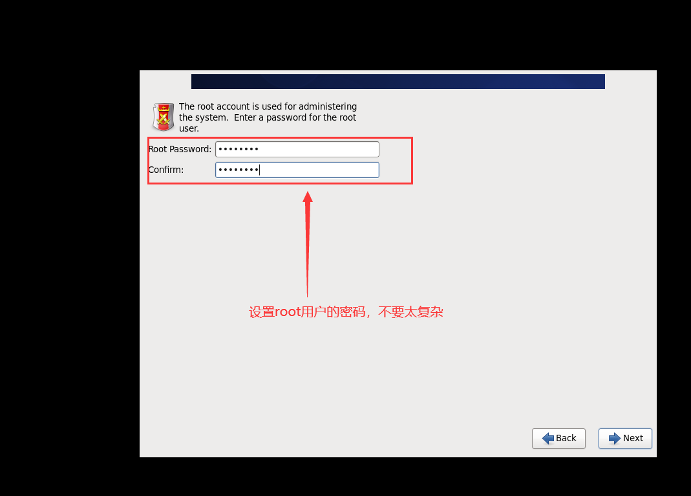

# 大数据实训大纲

### 一、大数据梗概

什么是大数据

​	 大数据，官方定义是指那些数据量特别大、数据类别特别复杂的数据集，这种数据集无法用传统的数据库进行存储，管理和处理。 大数据的主要特点为：

数据量大（Volume） 

数据类别复杂（Variety） 

数据处理速度快（Velocity） 

数据真实性高（Veracity） 

合起来被称为4V。 

​	还有的将大数据特点定义为6V模型，即增加了Valence（连接）、Value（价值）2V。 

大数据常见概念分类 大数据相关的概念大家都听过不少：HDFS、MapReduce、Spark、Storm、Spark Streaming、Hive、Hbase、Flume、Logstash、Kafka、Flink、Druid、ES等等。 是否感觉眼花缭乱？ 下面我们将这些常见的概念进行分组。 同一组的框架（工具）可以完成相同的工作，但各自使用的场景有所差异。

01 计算框架 离线计算：Hadoop MapReduce、Spark 实时计算：Storm、Spark Streaming、Flink 

02 存储框架 文件存储:Hadoop HDFS、Tachyon、KFS NOSQL数据库：HBase、MongoDB、Redis 全文检索：ES、Solr 

03 资源管理 YARN、Mesos 

04 日志收集 Flume、Logstash 

05 消息系统 Kafka、StormMQ、ZeroMQ、RabbitMQ 

06 查询分析 Hive、Impala、Pig、Presto、Phoenix、SparkSQL、Drill、Kylin、Druid 

### 二、Linux虚拟机的安装

```
https://jingyan.baidu.com/article/ab0b56305f2882c15afa7dda.html

## 解决内存虚拟化的问题
```

新建虚拟机


虚拟机打开黑屏的话，可以试下这个

以管理员身份运行命令窗口 输入cmd

输入命令netsh winsock rese 

然后重启电脑，再打开虚拟机


继续操作





```
sda1 启动盘分区 /boot
sda2 交换区 当我们内存的不够用的时候，可以去读取一部分磁盘空间作为内存使用
sda3 剩下的磁盘空间分配 /
```


第一次使用就安装桌面版本


安装完了以后是这个状态


### 三、虚拟机的相关配置

####  1、虚拟机的网络配置

**修改ifcfg-eth0配置**


**修改 network**


配置虚拟机网络编辑器


**添加默认网关**

```inux
route add default gw 192.168.56.254
```


**重启网卡**

```linux
service network restart
```

#### 2、修改主机名

```linux
如果感觉此主机名不合适，我们可以进行修改。通过编辑/etc/sysconfig/network 文件

[root@hadoop102 /]# vi /etc/sysconfig/network

文件中内容

NETWORKING=yes

NETWORKING_IPV6=no

HOSTNAME= hadoop102

注意：主机名称不要有“_”下划线
```

#### 3、防火墙设置

```linux
基本语法：

service iptables status （功能描述：查看防火墙状态）

chkconfig iptables –list （功能描述：查看防火墙开机启动状态）

service iptables stop （功能描述：临时关闭防火墙）

chkconfig iptables off （功能描述：关闭防火墙开机启动）

chkconfig iptables on （功能描述：开启防火墙开机启动）
```

#### 4、虚拟机的关机和重启

```
Linux 系统有 7 个运行级别(runlevel)

运行级别 0：系统停机状态，系统默认运行级别不能设为 0，否则不能正常启动

运行级别 1：单用户工作状态，root 权限，用于系统维护，禁止远程登陆

运行级别 2：多用户状态(没有 NFS)

运行级别 3：完全的多用户状态(有 NFS)，登陆后进入控制台命令行模式

运行级别 4：系统未使用，保留

运行级别 5：X11 控制台，登陆后进入图形 GUI 模式

运行级别 6：系统正常关闭并重启，默认运行级别不能设为 6，否则不能正常启动

4.5 关机重启

在 linux 领域内大多用在服务器上，很少遇到关机的操作。毕竟服务器上跑一个服务是

永无止境的，除非特殊情况下，不得已才会关机 。

正确的关机流程为：sync > shutdown > reboot > halt

1）基本语法：

（1）sync （功能描述：将数据由内存同步到硬盘中）

（2）shutdown [选项] 时间

选项：

-h：关机

-r：重启

（3）halt （功能描述：关闭系统，等同于 shutdown –h now 和 poweroff）

（4）reboot （功能描述：就是重启，等同于 shutdown –r now）

```

### 四、linux的基础命令操作

```
7.1.2 help 获得 shell 内置命令的帮助信息
1）基本语法：
help 命令 （功能描述：获得 shell 内置命令的帮助信息）
2）案例：
[root@hadoop101 bin]# help cd
7.1.3 常用快捷键
1）ctrl + c：停止进程
2）ctrl+l：清屏
3）ctrl + q：退出
4）善于用 tab 键
5）上下键：查找执行过的命令
6）ctrl +alt：linux 和 Windows 之间切换
7.2 文件目录类
7.2.1 pwd 显示当前工作目录的绝对路径
1）基本语法：
pwd （功能描述：显示当前工作目录的绝对路径）
2）案例

 
[root@hadoop106 home]# pwd
/home
7.2.2 ls 列出目录的内容
1）基本语法：
ls [选项] [目录或是文件]
选项：
-a ：全部的文件，连同隐藏档( 开头为 . 的文件) 一起列出来(常用)
-d ：仅列出目录本身，而不是列出目录内的文件数据(常用)
-l ：长数据串列出，包含文件的属性与权限等等数据；(常用)
每行列出的信息依次是： 文件类型与权限 链接数 文件属主 文件属组 文件大小用
byte来表示 建立或最近修改的时间 名字
2）案例
[atguigu@hadoop101 ~]$ ls -al
总用量 44
drwx------. 5 atguigu atguigu 4096 5月 27 15:15 .
drwxr-xr-x. 3 root root 4096 5月 27 14:03 ..
drwxrwxrwx. 2 root root 4096 5月 27 14:14 hello
-rwxrw-r--. 1 atguigu atguigu 34 5月 27 14:20 test.txt
7.2.3 mkdir 创建一个新的目录
1）基本语法：
mkdir [-p] 要创建的目录
选项：
-p：创建多层目录
2）案例
[root@hadoop106 opt]# mkdir test
[root@hadoop106 opt]# mkdir -p user/atguigu
7.2.4 rmdir 删除一个空的目录
1）基本语法：
rmdir 要删除的空目录
2）案例

 
[root@hadoop106 opt]# mkdir test
[root@hadoop106 opt]# rmdir test
7.2.5 touch 创建空文件
1）基本语法：
touch 文件名称
2）案例
[root@hadoop106 opt]# touch test.java
7.2.6 cd 切换目录
1）基本语法：
（1）cd 绝对路径
（2）cd 相对路径
（3）cd ~或者 cd （功能描述：回到自己的家目录）
（4）cd - （功能描述：回到上一次所在目录）
（5）cd .. （功能描述：回到当前目录的上一级目录）
（6）cd -P （功能描述：跳转到实际物理路径，而非快捷方式路径）
2）案例
（1）使用 mkdir 命令创建atguigu目录
[root@www ~]# mkdir atguigu
（2）使用绝对路径切换到atguigu目录
[root@www ~]# cd /root/atguigu/
（3）使用相对路径切换到atguigu目录
[root@www ~]# cd ./atguigu/
（4）表示回到自己的家目录，亦即是 /root 这个目录
[root@www atguigu]# cd ~
（5）cd- 回到上一次所在目录
[root@www atguigu]# cd -
（6）表示回到当前目录的上一级目录，亦即是 /root 的上一级目录的意思；
[root@www ~]# cd ..

 
7.2.7 cp 复制文件或目录
1）基本语法：
（1）cp source dest （功能描述：复制source文件到dest）
（2）cp -r sourceFolder targetFolder （功能描述：递归复制整个文件夹）
2）案例
（1）复制文件
[root@hadoop106 opt]# cp test.java test
（2）递归复制整个文件夹
[root@hadoop106 opt]# cp -r test test1
7.2.8 rm 移除文件或目录
1）基本语法
（1）rmdir deleteEmptyFolder （功能描述：删除空目录）
（2）rm -rf deleteFile （功能描述：递归删除目录中所有内容）
2）案例
1）删除空目录
[root@hadoop106 opt]# rmdir test
2）递归删除目录中所有内容
[root@hadoop106 opt]# rm -rf test1
7.2.9 mv 移动文件与目录或重命名
1）基本语法：
（1）mv oldNameFile newNameFile （功能描述：重命名）
（2）mv /temp/movefile /targetFolder （功能描述：移动文件）
2）案例：
1）重命名
[root@hadoop106 opt]# mv test.java test1.java
2）移动文件
[root@hadoop106 opt]# mv test1.java test1

 
7.2.10 cat 查看文件内容
查看文件内容，从第一行开始显示。
1）基本语法
cat [选项] 要查看的文件
选项：
-A ：相当于 -vET 的整合选项，可列出一些特殊字符而不是空白而已；
-b ：列出行号，仅针对非空白行做行号显示，空白行不标行号！
-E ：将结尾的断行字节 $ 显示出来；
-n ：列出行号，连同空白行也会有行号，与 -b 的选项不同；
-T ：将 [tab] 按键以 ^I 显示出来；
-v ：列出一些看不出来的特殊字符
2）案例
[atguigu@hadoop101 ~]$ cat -A test.txt
hellda $
dasadf ^I$
da^I^I^I$
das$
7.2.11 tac 查看文件内容
查看文件内容，从最后一行开始显示，可以看出 tac 是 cat 的倒著写。
1）基本语法：
cat [选项参数] 要查看的文件
2）案例
[root@hadoop106 test1]# cat test1.java
hello
atguigu
atguigu1
[root@hadoop106 test1]# tac test1.java

 
atguigu1
atguigu
hello
7.2.12 more 查看文件内容
查看文件内容，一页一页的显示文件内容。
1）基本语法：
more 要查看的文件
2）功能使用说明
空白键 (space)：代表向下翻一页；
Enter:代表向下翻『一行』；
q:代表立刻离开 more ，不再显示该文件内容。
Ctrl+F 向下滚动一屏
Ctrl+B 返回上一屏
= 输出当前行的行号
:f 输出文件名和当前行的行号
3）案例
[root@hadoop106 test1]# more test1.java
7.2.13 less 查看文件内容
less 的作用与 more 十分相似，都可以用来浏览文字档案的内容，不同的是 less 允许
使用[pageup] [pagedown]往回滚动。
1）基本语法：
less 要查看的文件
2）功能使用说明
空白键 ：向下翻动一页；
[pagedown]：向下翻动一页；
[pageup] ：向上翻动一页；
/字串 ：向下搜寻『字串』的功能；
?字串 ：向上搜寻『字串』的功能；

 
q ：离开 less 这个程序；
3）案例
[root@hadoop106 test1]# less test1.java
7.2.14 head 查看文件内容
查看文件内容，只看头几行。
1）基本语法
head -n 10 文件 （功能描述：查看文件头10行内容，10可以是任意行数）
2）案例
[root@hadoop106 test1]# head -n 2 test1.java
hello
atguigu
7.2.15 tail 查看文件内容
查看文件内容，只看尾巴几行。
1）基本语法
（1）tail -n 10 文件 （功能描述：查看文件头10行内容，10可以是任意行数）
（2）tail –f 文件 （功能描述：实时追踪该文档的所有更新）
2）案例
（1）查看文件头1行内容
[root@hadoop106 test1]# tail -n 1 test1.java
Atguigu
（2）实时追踪该档的所有更新
[root@hadoop106 test1]# tail -f test1.java
hello
atguigu
atguigu
7.2.16 重定向命令
1）基本语法：
（1）ls –l >文件 （功能描述：列表的内容写入文件 a.txt 中（覆盖写））

 
（2）ls –al >>文件 （功能描述：列表的内容追加到文件 aa.txt 的末尾）
2）案例
（1）[root@hadoop101 opt]# ls -l>t.txt
（2）[root@hadoop101 opt]# ls -l>>t.txt
（3）[root@hadoop106 test1]# echo hello>>test1.java
7.2.17 echo
1）基本语法：
（1）echo 要显示的内容 >> 存储内容的的文件 （功能描述：将要显示的内容，存储
到文件中）
（2）echo 变量 （功能描述：显示变量的值）
2）案例
[root@hadoop106 test1]# echo $JAVA_HOME
/opt/module/jdk1.7.0_79
7.2.18 ln 软链接
1）基本语法：
ln –s [原文件] [目标文件] （功能描述：给原文件创建一个软链接，软链接存放在
目标文件目录）
2）案例：
[root@hadoop101 module]# ln -s /opt/module/test.txt /opt/t.txt
[root@hadoop101 opt]# ll
lrwxrwxrwx. 1 root root 20 6 月 17 12:56 t.txt -> /opt/module/test.txt
创建一个软链接
[atguigu@hadoop103 opt]$ ln -s /opt/module/hadoop-2.7.2/ /opt/software/hadoop
cd 不加参数进入是软链接的地址
[atguigu@hadoop103 software]$ cd hadoop
[atguigu@hadoop103 hadoop]$ pwd
/opt/software/hadoop

 
cd 加参数进入是实际的物理地址
[atguigu@hadoop103 software]$ cd -P hadoop
[atguigu@hadoop103 hadoop-2.7.2]$ pwd
/opt/module/hadoop-2.7.2
7.2.19 history 查看所敲命令历史
1）基本语法：
history
2）案例
[root@hadoop106 test1]# history
7.3 时间日期类
1）基本语法
date [OPTION]... [+FORMAT]
7.3.1 date 设置系统时间
1）基本语法：
date -s 字符串时间
2）案例
[root@hadoop106 /]# date -s "2017-06-19 20:52:18"
7.3.2 date 显示当前时间
1）基本语法：
（1）date （功能描述：显示当前时间）
（2）date +%Y （功能描述：显示当前年份）
（3）date +%m （功能描述：显示当前月份）
（4）date +%d （功能描述：显示当前是哪一天）
（5）date +%Y%m%d date +%Y/%m/%d … （功能描述：显示当前年月日各种格式 ）
（6）date "+%Y-%m-%d %H:%M:%S" （功能描述：显示年月日时分秒）
2）案例
[root@hadoop106 /]# date

 
2017 年 06 月 19 日 星期一 20:53:30 CST
[root@hadoop106 /]# date +%Y%m%d
20170619
[root@hadoop106 /]# date "+%Y-%m-%d %H:%M:%S"
2017-06-19 20:54:58
7.3.3 date 显示非当前时间
1）基本语法：
（1）date -d '1 days ago' （功能描述：显示前一天日期）
（2）date -d yesterday +%Y%m%d （同上）
（3）date -d next-day +%Y%m%d （功能描述：显示明天日期）
（4）date -d 'next monday' （功能描述：显示下周一时间）
2）案例：
[root@hadoop106 /]# date -d '1 days ago'
2017 年 06 月 18 日 星期日 21:07:22 CST
[root@hadoop106 /]# date -d next-day +%Y%m%d
20170620
[root@hadoop106 /]# date -d 'next monday'
2017 年 06 月 26 日 星期一 00:00:00 CST
7.3.4 cal 查看日历
1）基本语法：
cal [选项] （功能描述：不加选项，显示本月日历）
选项：
-3 ，显示系统前一个月，当前月，下一个月的日历
具体某一年，显示这一年的日历。
2）案例：
[root@hadoop106 /]# cal
[root@hadoop106 /]# cal -3
[root@hadoop106 /]# cal 2016


查看端口号
netstat -apn|grep 5601
查看详细进程
ps -aux|grep java
查看所有端口号
netstat -ltunp
```

### 五、配置ssh免密登录

```
配置hosts映射文件
##1.进入到root的家目录
cd 
##2.编辑映射文件
vi /etc/hosts
##3.将编辑好的文件发送给其他虚拟机(默认会覆盖文件)
sudo scp /etc/hosts 192.168.56.42:/etc/hosts

```

```
##创建两个钥匙（私钥）（公钥）
ssh-keygen -t rsa
##发送公钥 接受公钥的主机
ssh-copy-id 主机名

文件 authorized_keys
存放的是 当前主机有哪些主机的公钥 
言下之意 当前主机可以被哪些主机登陆

文件 known_hosts
存放的是 当前主机知道哪些主机
言下之意 当前主机登陆过哪些主机
```


```
-               r - x             r - -              - - -

该文件的类型    超级管理员权限    同用户组之间权限     普通用户的权限

-      -     -
r      w     x 
2^2   2^1   2^0


#修改权限
chmod 744 ./test

所属用户 所属用户组
chown root:hadoop ./test

日志级别
INFO DEBUG WARN ERROR
```

### 六、linux相关软件安装（JDK、mysql）

#### 1、JDK的安装

卸载原来虚拟机安装的jdk

```linux
查看安装的jdk
rpm -qa | grep jdk

卸载jdk
rpm -e --nodeps java-1.7.0-openjdk-1.7.0.79-2.5.5.4.el6.x86_64
rpm -e --nodeps java-1.6.0-openjdk-1.6.0.35-1.13.7.1.el6_6.x86_64

tar -zxvf /opt/softs/jdk-8u181-linux-x64.tar.gz -C /opt/apps/
```

配置环境变量

```linux
export JAVA_HOME=/opt/apps/jdk1.8.0_181
export PATH=$PATH:$JAVA_HOME/bin

刷新环境变量
source /etc/profile
```

#### 2、mysql的安装

卸载原来安装的mysql

```linux
## 查看原来安装了哪些mysql
rpm -qa | grep mysql

## 卸载原来的mysql
rpm -e --nodeps mysql-libs-5.1.73-5.el6_6.x86_64

## 安装自己的mysql
rpm -ivh ./MySQL-client-5.5.47-1.linux2.6.x86_64.rpm

rpm -ivh ./MySQL-server-5.5.47-1.linux2.6.x86_64.rpm

## 启动mysql服务
service mysql start
```

配置mysql

```mysql
## 添加root用户密码
mysqladmin -u root password "root"

## 添加hadoop01加密码
## 进入到MySQL数据库中更改user表
update user set Password='*81F5E21E35407D884A6CD4A731AEBFB6AF209E1B' where Host='hadoop' and User='root';

## 添加除服务器之外任何主机的使用root用户登录都是root密码
grant all privileges on *.* to 'root'@'%' identified by 'root';

## 刷新权限
flush privileges;

##使用navcat访问要记得关闭防火墙
service iptables stop
```

### 七、hadoop集群的部署

#### 1、hadoop的概述

简介：

​	Hadoop是一个由Apache基金会所开发的[分布式系统](https://baike.baidu.com/item/%E5%88%86%E5%B8%83%E5%BC%8F%E7%B3%BB%E7%BB%9F/4905336)基础架构。用户可以在不了解分布式底层细节的情况下，开发分布式程序。充分利用集群的威力进行高速运算和存储。Hadoop实现了一个[分布式文件系统](https://baike.baidu.com/item/%E5%88%86%E5%B8%83%E5%BC%8F%E6%96%87%E4%BB%B6%E7%B3%BB%E7%BB%9F/1250388)（Hadoop Distributed File System），简称HDFS。HDFS有高[容错性](https://baike.baidu.com/item/%E5%AE%B9%E9%94%99%E6%80%A7/9131391)的特点，并且设计用来部署在低廉的（low-cost）硬件上；而且它提供高吞吐量（high throughput）来访问[应用程序](https://baike.baidu.com/item/%E5%BA%94%E7%94%A8%E7%A8%8B%E5%BA%8F/5985445)的数据，适合那些有着超大数据集（large data set）的应用程序。HDFS放宽了（relax）POSIX的要求，可以以流的形式访问（streaming access）文件系统中的数据。Hadoop的框架最核心的设计就是：HDFS和MapReduce。HDFS为海量的数据提供了存储，而MapReduce则为海量的数据提供了计算 [1]  。 


三台虚拟机学习的意义 -> 搭建集群 三台的意义-> (1、三是奇数 2、三可以更好的体现主（最重要的那台节点）从（出了最重要的那台节点以外的节点）的概念)


#### 2、伪分布式的安装

对于之前的操作，是Hadoop的单机版的运行模型，单机版的运行模式，数据都是在本地运行和存储的

根据官方网站的提示；首先在伪分布式的环境中首先需要配置如下配置文件

1 etc/hadoop/core-site.xml:  可以通过notepad++工具连接到linux上进行配置的编辑

安装notepad++

将NppFTP.dll文件拷贝到notepad++的目录下


	

​	点击该配置项进行linux 路径的配置


​	点击连接linux


​	首先解压hadoop的安装包

```
tar -zxvf /opt/softs/hadoop-2.7.2.tar.gz -C /opt/apps
```

​	进入hadoop-2.7.2	的etc下hadoop目录找到hadoop-env.sh的配置文件

```linux
cd /opt/apps/hadoop-2.7.2/etc/hadoop

vi hadoop-env.sh

#添加如下配置
export JAVA_HOME=/opt/apps/jdk1.8.0_181
```

​	根据该工具，对core-site.xml文件进行如下配置

```xml
<property>
	<name>fs.defaultFS</name>
	<value>hdfs://hadoop01:8020</value>
</property>
```

​	fs.defaultFS： 默认的配置名称，HDFS路径默认配置名称

​	hdfs://hadoop01:8020 HDFS 文件系统的路径

​	配置完以上的配置信息之后，还需要配置如下内容

```xml
<property>
	<name>hadoop.tmp.dir</name>
	<value>/opt/apps/hadoop-2.7.2/data/tmp</value>
</property>
```

​	该属性表示，Hadoop在运行的时候产生的临时文件。以及HDFS edits fsimage 存储父目录位置。该属性默认值保存在linux /tmp 目录下，该目录是一个临时目录。把内容保存在该目录下明显不适合需要重新自定义

1. 配置etc/hadoop/hdfs-site.xml: 修改该文件中HDFS 副本数，由于目前使用的是伪分布式只有一台节点，所以不能使用默认的副本数3 要修改为1

```xml
<property>
	<name>dfs.replication</name>
	<value>1</value>
</property>
```

1. 完成以上的配置之后，可以去格式化HDFS文件系统，格式化的目的是生成 fsimage 和edits文件 用于保存用户在namenode内存的元数据 

```linux
bin/hadoop namenode -format
```


1. 格式化成功之后，启动HDFS的服务进程。需要启动两个进程 分为为

Namenode  以及 datanode

 	由于现在没有配置ssh免密登录。可以使用分别启动的方式进行服务的启动

1. 使用hadoop-daemon.sh  分别启动 namenode 以及 datanode 启动的命令如下

```linux
sbin/hadoop-daemon.sh start namenode
sbin/hadoop-daemon.sh start datanode
```

​	启动完成之后，可以通过jps命令去查看进程是否启动


​	启动成功之后，也可以web 浏览器的方式访问HDFS 文件系统访问路径如下

```http
http://hadoop01:50070
```

1. 配置Yarn 环境 

   1）根据官方文档的提示，需要配置etc/hadoop/mapred-site.xml: 指定MR任务在yarn上运行 

```xml
<property>
	<name>mapreduce.framework.name</name>
	<value>yarn</value>
</property>
```

​	2）配置etc/hadoop/yarn-site.xml: 指定yarn服务类名称 为shuffle 

```xml
<property>
	<name>yarn.nodemanager.aux-services</name>
	<value>mapreduce_shuffle</value>
</property>
```

​	以上的配置完成之后，就可以进行Yarn集群的启动

```linux
sbin/yarn-daemon.sh start resourcemanager
sbin/yarn-daemon.sh start nodemanager
```

​	Yarn 也存在web界面，通过8088端口去查看

```http
http://hadoop01:8088
```

​	可以通过web 接口的方式查看在yarn运行的任务 


​	对于以上的配置，伪分布式需要的组件已经安装完成。但是启动集群命令的时候需要单独启动。 也可以通过设置ssh免密登录的方式进行全部启动与停止

 	在进行集群全部启动的时候，需要配置slaves 配置文件。在该文件中配置从节点的主机名称 在hadoop中从节点为datanode 与nodemanager 往往这两个服务都在一台节点上


**错误**

如果你的namenode启动失败，或者总是容易掉进程，最简单的恢复办法就是重新格式化namenode步骤如下

1、把和hdfs相关的进程全部杀死

2、删除hadoop2.7.2下的data目录

3、清空hadoop2.7.2下的logs目录

4、重新格式化（前提是你hdfs相关的配置不会出现问题）

#### 3、完全分布式部署

​	完全分布式安装部署，其实步骤上来说与伪分布式没有太大的区别，主要增加2台虚拟机部署称为一个3台的集群

​	1）环境的准备

​	在现有基础上克隆出来2台虚拟机，并且修改网段IP ,以及主机名称 映射路径 hosts ,关闭防火墙。

​	完成以上的环境准备之后，应该手头上存在3台虚拟机，并且防火墙已经关闭，而且设置好了主机名称以及映射地址

 	2）集群的规划

 	主要需要配置的组件：HDFS(负责存储)  Yarn  HistoryServer

| pc1         | Pc2               | Pc3             |
| ----------- | ----------------- | --------------- |
| NameNode    | Datanode          | DataNode        |
| DataNode    | SecondaryNameNode | Resourcemanager |
| nodemanager | nodemanger        | nodemanager     |

​	3) 集群的安装

​	在集群安装之前，必须要安装JDK环境

​	配置Hadoop完全分布式环境，从配置文件开始

 	首先解压hadoop安装路径到/opt/apps中

```linux
sudo tar -zvxf /opt/softs/hadoop-2.7.2.tar.gz -C /opt/apps
```

1. 修改Hadoop-env.sh 中 JAVA_HOME路径

```linux
export JAVA_HOME=/opt/app/jdk1.8.0_181
```

1. 配置core-site.xml 配置文件

```xml
<property>
    <name>fs.defaultFS</name>
    <value>hdfs://hadoop01:8020</value>
</property>
<property>
    <name>hadoop.tmp.dir</name>
    <value>/opt/apps/hadoop-2.7.2/data/tmp</value>
</property>
```

1. 配置hdfs-site.xml 

```xml
<property>
	<name>dfs.replication</name>
	<value>3</value>
</property>

<property>
    <name>dfs.namenode.secondary.http-address</name>
    <value>hadoop02:50090</value>
</property>

<property>
    <name>dfs.namenode.http-address</name>
    <value>hadoop01:50070</value>
</property>

<property>
    <name>dfs.permissions.enabled</name>
    <value>false</value>
</property>
```

​	dfs.namenode.secondary.http-address: 设置secondaryNameNode服务进程的主机位置

 	dfs.namenode.http-address：NameNode WEB界面访问的地址配置

 	dfs.permissions.enabled：HDFS的权限验证 默认开启 需要关闭

1. 配置yarn.site.xml配置文件

```xml
<property>
    <name>yarn.resourcemanager.hostname</name>
    <value>hadoop03</value>
</property>

<property>
    <name>yarn.nodemanager.aux-services</name>
    <value>mapreduce_shuffle</value>
</property>  

<property>
    <name>yarn.log-aggregation-enable</name>
    <value>true</value>
</property>

<property>
    <name>yarn.log-aggregation.retain-seconds</name>
    <value>604800</value>
</property>
```

​	yarn.resourcemanager.hostname： 指定Resourcemanager 在指定节点上 

1. 配置mapred-site.xml配置文件 

```xml
<property>
    <name>mapreduce.framework.name</name>
    <value>yarn</value>
</property>

<property>
    <name>mapreduce.jobhistory.address</name>
    <value>hadoop03:10020</value>
</property>

<property>
    <name>mapreduce.jobhistory.webapp.address</name>
    <value>hadoop03:19888</value>
</property>
```

​	现在是完全分布式的环境，所以还需要配置slaves文件，把从节点的主机名称添加进去

```linux
hadoop01
hadoop02
hadoop03
```

​	在分发之前，需要把etc/hosts 文件下配置好的映射地址分发到不同的节点上 保证每个节点上的hosts文件都是一样的

 	可以使用scp命令在不同的节点之间进行拷贝，命令使用方式如下

```linux
sudo scp /etc/hosts hadoop03:/etc/hosts
```

​	分发hadoop到不同的节点上

```linux
sudo scp -r /opt/apps/hadoop-2.7.2/ hadoop03:/opt/apps/
```

 	格式化：namenode

 	在节点分发完成之后,在hadoop01节点上格式化namenode(namenode所在节点格式化)

```linux
bin/hadoop namenode -format
```

​	启动进程：

 	先单个节点启动HDFS测试：在hadoop01上启动namenode 与datanode

```linux
sbin/hadoop-daemon.sh start namenode
sbin/hadoop-daemon.sh start datanode
```

​	接下来在其他节点上启动datanode

```linux
sbin/hadoop-daemon.sh start datanode
```

​	在单节点上启动Yarn测试

​	在Hadoop03上启动resourcemanager

```linux
sbin/yarn-daemon.sh start resourcemanager
```

 	接下来在不同的节点上启动nodemanager

 	配置完ssh免密码登录之后就可以 使用start-all.sh 或者stop-all.sh

#### 4、虚拟机重启出现警告

如果linux重启出现如下警告


这是因为清除/tmp目录所导致的

修改/tmp文件夹的权限即可恢复

```linux
chmod 777 /tmp

重启虚拟机
reboot
```


这样就可以了

### 八、zookeeper的安装和使用

#### 1、概述

ZooKeeper是Hadoop的正式子项目，它是一个针对大型分布式系统的可靠协调系统，提供的功能包括：配置维护、名字服务、分布式同步、组服务等。ZooKeeper的目标就是封装好复杂易出错的关键服务，将简单易用的接口和性能高效、功能稳定的系统提供给用户。

Zookeeper是Google的Chubby一个开源的实现.是高有效和可靠的协同工作系统.Zookeeper能够用来leader选举,配置信息维护等.在一个分布式的环境中,我们需要一个Master实例或存储一些配置信息,确保文件写入的一致性等.Zookeeper能够保证如下3点:

- Watches are ordered with respect to other events, other watches, and
  asynchronous replies. The ZooKeeper client libraries ensures that
  everything is dispatched in order.
- A client will see a watch event for a znode it is watching before seeing the new data that corresponds to that znode.
- The order of watch events from ZooKeeper corresponds to the order of the updates as seen by the ZooKeeper service.

 

在Zookeeper中,znode是一个跟Unix文件系统路径相似的节点,可以往这个节点存储或获取数据.如果在创建znode时Flag设置 为EPHEMERAL,那么当这个创建这个znode的节点和Zookeeper失去连接后,这个znode将不再存在在Zookeeper 里.Zookeeper使用Watcher察觉事件信息,当客户端接收到事件信息,比如连接超时,节点数据改变,子节点改变,可以调用相应的行为来处理数 据.Zookeeper的Wiki页面展示了如何使用Zookeeper来处理事件通知,队列,优先队列,锁,共享锁,可撤销的共享锁,两阶段提交.

那么Zookeeper能帮我们作什么事情呢?简单的例子:假设我们我们有个20个搜索引擎的服务器(每个负责总索引中的一部分的搜索任务)和一个 总服务器(负责向这20个搜索引擎的服务器发出搜索请求并合并结果集),一个备用的总服务器(负责当总服务器宕机时替换总服务器),一个web的 cgi(向总服务器发出搜索请求).搜索引擎的服务器中的15个服务器现在提供搜索服务,5个服务器正在生成索引.这20个搜索引擎的服务器经常要让正在 提供搜索服务的服务器停止提供服务开始生成索引,或生成索引的服务器已经把索引生成完成可以搜索提供服务了.使用Zookeeper可以保证总服务器自动 感知有多少提供搜索引擎的服务器并向这些服务器发出搜索请求,备用的总服务器宕机时自动启用备用的总服务器,web的cgi能够自动地获知总服务器的网络 地址变化.这些又如何做到呢?

1. 提供搜索引擎的服务器都在Zookeeper中创建znode,zk.create("/search/nodes/node1",
   "hostname".getBytes(), Ids.OPEN_ACL_UNSAFE, CreateFlags.EPHEMERAL);
2. 总服务器可以从Zookeeper中获取一个znode的子节点的列表,zk.getChildren("/search/nodes", true);
3. 总服务器遍历这些子节点,并获取子节点的数据生成提供搜索引擎的服务器列表.
4. 当总服务器接收到子节点改变的事件信息,重新返回第二步.
5. 总服务器在Zookeeper中创建节点,zk.create("/search/master", "hostname".getBytes(), Ids.OPEN_ACL_UNSAFE, CreateFlags.EPHEMERAL);
6. 备用的总服务器监控Zookeeper中的"/search/master"节点.当这个znode的节点数据改变时,把自己启动变成总服务器,并把自己的网络地址数据放进这个节点.
7. web的cgi从Zookeeper中"/search/master"节点获取总服务器的网络地址数据并向其发送搜索请求.
8. web的cgi监控Zookeeper中的"/search/master"节点,当这个znode的节点数据改变时,从这个节点获取总服务器的网络地址数据,并改变当前的总服务器的网络地址.

 

#### 2、zookeeper的安装

解压

```linux
tar -zxvf /opt/softs/zookeeper-3.4.10.tar.gz -C /opt/apps/
```

新建文件夹zkData

```linux
mkdir /opt/appss/zookeeper-3.4.10/zkData
```

进入zookeeper的目录，将zoo_sample.cfg重命名为zoo.cfg

```linux
mv /opt/softs/zookeeper-3.4.10/zoo_sample.cfg /opt/softs/zookeeper-3.4.10/zoo.cfg
```

修改zoo.cfg的配置文件

```linux
## 将你创建的文件夹配置过来
dataDir=/opt/apps/zookeeper-3.4.10/zkData

## 将你zookeeper的集群全部配置过来
server.1=hadoop01:2888:3888
server.2=hadoop02:2888:3888
server.3=hadoop03:2888:3888
```

去到你的zkData的文件夹下创建myid文件

```linux
vi myid

在myid中添加数字 更具上面server.1/server.2/server.3选择对应的主机名称添加数字

如在hadoop01这台主机上的myid里添加1
```

配置完分发到你集群的所有机子上，并记得修改myid里的值，到此zookeeper安装完成

#### 3、zookeeper的启动

启动

```
bin/zkServer.sh start
```

查看状态

```linux
bin/zkServer.sh status
```

三台都启动


配置没有问题的话，应该会有一台leader 两台follower，这样你就安装成功了

**通过shell脚本启动zookeeper集群**

```linux
vim zk.sh
```


```shell
#! /bin/bash

case $1 in
"start"){
        for i in test01 test02 test03
        do
                echo " --------启动 $i zookeeper-------"
                ssh $i "/opt/apps/zookeeper-3.4.10/bin/zkServer.sh start"
        done
};;
"stop"){
        for i in test01 test02 test03
        do
                echo " --------关闭 $i zookeeper-------"
                ssh $i "/opt/apps/zookeeper-3.4.10/bin/zkServer.sh stop"
        done
};;
"status"){
        for i in test01 test02 test03
        do
                echo " --------查看 $i zookeeper服务的状态-------"
                ssh $i "/opt/apps/zookeeper-3.4.10/bin/zkServer.sh status"
        done
};;
esac

```

这里就会出现一个问题，无法通过脚本启动的zookeeper集群

原因和linux虚拟机登录方式和环境变量的加载有关

```txt
首先知道交互式shell和非交互式shell、登录shell和非登录shell是有区别的
在登录shell里，环境信息需要读取/etc/profile和~ /.bash_profile, ~/.bash_login, and ~/.profile按顺序最先的一个，并执行其中的命令。除非被 —noprofile选项禁止了；在非登录shell里，环境信息只读取 /etc/bash.bashrc和~/.bashrc 
手工执行是属于登陆shell，脚本执行数据非登陆shell，而我的linux环境配置中只对/etc/profile进行了jdk1.8等环境的配
置，所以脚本执行/opt/module/zookeeper-3.4.10/bin/zkServer.sh start 启动zookeeper失败了
 
解决方法
 
把profile的配置信息echo到.bashrc中  cat  /etc/profile  >> ~/.bashrc
```

### 九、hadoop集群HA(高可用的搭建)

|        hadoop01         |         hadoop02         |        hadoop03         |
| :---------------------: | :----------------------: | :---------------------: |
|     QuorumPeerMain      |      QuorumPeerMain      |     QuorumPeerMain      |
|       journalnode       |       journalnode        |       journalnode       |
|    namenode(active)     |    namenode(standby)     |        datanode         |
|        datanode         |         datanode         | Resourcemanager(active) |
|       nodemanager       | Resourcemanager(standby) |       nodemanager       |
| DFSZKFailoverController |       nodemanager        |                         |
|                         | DFSZKFailoverController  |                         |


#### 1、Namenode HA环境搭建

​	在配置HA环境之前，首先包正zookeeper已经安装完毕 

​	首先在core.site.xml配置文件中，配置如下信息

```xml
<configuration>
	<property>
		<name>fs.defaultFS</name>
		<value>hdfs://ns1</value>
	</property>
	<property>
		<name>hadoop.tmp.dir</name>
		<value>/opt/app/hadoop-2.7.2/data/tmp</value>
	</property>
    <property>
        <name>ha.zookeeper.quorum</name>
        <value>hadoop01:2181,hadoop02:2181,hadoop03:2181</value>
    </property>
</configuration>
```

​	把一个hdfs的namenode路径修改为集群HA对外的名称 

​	在hdfs-site.xml 文件中配置如下信息 

```xml
<configuration>
    ## 设置副本数
    <property>
        <name>dfs.replication</name>
        <value>3</value>
    </property>
	## 如果无法访问50070的端口就添加这个配置
	<property>
		<name>dfs.http.address</name>
		<value>0.0.0.0:50070</value>
	</property>
	## 集群的服务名称
	<property>
		<name>dfs.nameservices</name>
		<value>ns1</value>
	</property>
	## 在集群服务名称下配置两个namenode nn1 nn2
	<property>
		<name>dfs.ha.namenodes.ns1</name>
		<value>nn1,nn2</value>
	</property>
	## 配置nn1 namenode的路径
	<property>
		<name>dfs.namenode.rpc-address.ns1.nn1</name>
		<value>hadoop01:8020</value>
	</property>
	## 配置nn2 namenode的路径
	<property>
		<name>dfs.namenode.rpc-address.ns1.nn2</name>
		<value>hadoop02:8020</value>
	</property>
	## 配置namenode1 web接口的地址
	<property>
		<name>dfs.namenode.http-address.ns1.nn1</name>
		<value>hadoop01:50070</value>
	</property>
	## 配置namenode2 web接口的地址
	<property>
		<name>dfs.namenode.http-address.ns1.nn2</name>
		<value>hadoop02:50070</value>
	</property>
	## 配置日志服务器的地址
	<property>
		<name>dfs.namenode.shared.edits.dir</name>
		<value>qjournal://hadoop01:8485;hadoop02:8485;hadoop03:8485/ns1</value>
	</property>
	## 配置日志服务器存储日志在磁盘上的位置
	<property>
		<name>dfs.journalnode.edits.dir</name>
		<value>/opt/app/hadoop-2.7.2/journalnode</value>
	</property>
	## 配置HA下客户端代理服务器
	<property>
        <name>dfs.client.failover.proxy.provider.ns1</name>
         <value>org.apache.hadoop.hdfs.server.namenode.ha.ConfiguredFailoverProxyProvider</value>
	</property>
	## 配置ssh 免密登录用于standby 当kill掉active
	<property>
		<name>dfs.ha.fencing.methods</name>
		<value>sshfence</value>
	</property>
	## 配置私钥的路径
	<property>
		<name>dfs.ha.fencing.ssh.private-key-files</name>
		<value>/home/hadoop/.ssh/id_rsa</value>
	</property>
	## ssh kill 时限
	<property>
		<name>dfs.ha.fencing.ssh.connect-timeout</name>
		<value>30000</value>
	</property>
	## 配置hdfs检查权限
	<property>
		<name>dfs.permissions.enabled</name>
		<value>false</value>
	</property>
	## 开启自动故障转移
	<property>
		<name>dfs.ha.automatic-failover.enabled</name>
		<value>true</value>
	</property>
</configuration>
```

​	配置完以上的内容之后，需要把节点分发到各个节点

 	注意： 在分发之前，需要把原来文件data/tmp 目录下的文件，以及logs 下面的文件 还有根目录/tmp下面的文件全部清空

 	启动的顺序：

​	1 先启动zookeeper  

```linux
bin/zkServer.sh start  依次启动3台zookeeper
```

​	2 启动journalnode （日志服务器）

```
sbin/hadoop-daemon.sh start journalnode   3台

```

​	必须先启动zookeeper 才能启动journalnode

​	要确保你的journalnode启动没有问题 可以通过查看hadoop中logs目录下的日志来查看

​	 **确保三台虚拟机的防火墙是关闭状态**

​	3 格式化hdfs namenode（在两台配置了namenode的虚拟机的一台上格式化namenode即可即可）

```linux
bin/hdfs namenode -format
```

​	4 格式化完成在格式化了namenode的虚拟机上先启动namenode 服务 

```linux
sbin/hadoop-daemon.sh start namenode
```

​	5 在另一台配置了namenode的虚拟机上同步刚刚启动了namenode active的元数据

```linux
bin/hdfs namenode -bootstrapStandby  同步元数据
About to bootstrap Standby ID nn2 from:
           Nameservice ID: ns1
        Other Namenode ID: nn1
  Other NN's HTTP address: http://hadoop01:50070
  Other NN's IPC  address: hadoop01/10.36.143.140:8020
             Namespace ID: 1400592920
            Block pool ID: BP-206752366-10.36.143.140-1544684131154
               Cluster ID: CID-b5588c4f-b9e4-4e29-b39f-e33d3edd2ed1
           Layout version: -63
       isUpgradeFinalized: true
```

​	看到以上的信息代表同步成功 

然后关闭namenode,journalnode进程

​	6 初始化zkfc 在zookeeper中初始化hadoopHA的信息（在第一台初始化即可）

```linux
bin/hdfs zkfc -formatZK
```

​	7 直接启动hdfs 

```xml
sbin/start-dfs.sh  启动全部的hdfs组件
```


三台虚拟机的进程如图所示代表启动成功

​	8 查看nn1的状态

```linux
bin/hdfs haadmin -getServiceState nn1
```

	

​	9 查看nn2的状态

```linux
bin/hdfs haadmin -getServiceState nn2
```


#### 2、ResourceManagerHA 环境搭建

​	RM HA机制主要是为了解决RM 出现单点故障，切换机制比较简单，主要是在zookeeper中记录RM的状态  当activeRM出现故障，则通过zookeeper切换到standby

 	环境的搭建步骤：

 	修改yarn.-site.xml配置文件增加如下信息

```xml
<?xml version="1.0"?>
<!--
  Licensed under the Apache License, Version 2.0 (the "License");
  you may not use this file except in compliance with the License.
  You may obtain a copy of the License at

    http://www.apache.org/licenses/LICENSE-2.0

  Unless required by applicable law or agreed to in writing, software
  distributed under the License is distributed on an "AS IS" BASIS,
  WITHOUT WARRANTIES OR CONDITIONS OF ANY KIND, either express or implied.
  See the License for the specific language governing permissions and
  limitations under the License. See accompanying LICENSE file.
-->
<configuration>

<!-- Site specific YARN configuration properties -->
    ## yarn的高可用要开启
	<property>
	  <name>yarn.resourcemanager.ha.enabled</name>
	  <value>true</value>
	</property>
	
    ## yarn配置一个对外统一对的名称
	<property>
	  <name>yarn.resourcemanager.cluster-id</name>
	  <value>cluster1</value>
	</property>
    
    ## 配置两个resourcemanager
	<property>
		  <name>yarn.resourcemanager.ha.rm-ids</name>
		  <value>rm1,rm2</value>
	</property>
    
    ## 配置rm1在哪台主机上
	<property>
		  <name>yarn.resourcemanager.hostname.rm1</name>
		  <value>hadoop02</value>
	</property>
    
    ## 配置rm2在哪台主机上
	<property>
		  <name>yarn.resourcemanager.hostname.rm2</name>
		  <value>hadoop03</value>
	</property>
    
    ## 配置rm1 web页面的访问端口
	<property>
		  <name>yarn.resourcemanager.webapp.address.rm1</name>
		  <value>hadoop02:8088</value>
	</property>
    
    ## 配置rm2 web页面的访问端口
	<property>
		  <name>yarn.resourcemanager.webapp.address.rm2</name>
		  <value>hadoop03:8088</value>
	</property>
    
    ## 配置zookeeper的集群
	<property>
	  <name>yarn.resourcemanager.zk-address</name>
	  <value>hadoop01:2181,hadoop02:2181,hadoop03:2181</value>
	</property>
	
    ## 配置nodemanager重启
	<property>
		<name>yarn.nodemanager.recovery.enabled</name>
		<value>true</value>
    </property>

    ## 配置resourcemanager的元数据
	<property>
		<name>yarn.resourcemanager.store.class</name>
		<value>org.apache.hadoop.yarn.server.resourcemanager.recovery.FileSystemRMStateStore</value>
	</property>

    ## 配置nodemanager的计算框架
	<property>
		<name>yarn.nodemanager.aux-services</name>
		<value>mapreduce_shuffle</value>
    </property>  
   
    ## 配置日志的获取
    <property>
        <name>yarn.log-aggregation-enable</name>
        <value>true</value>
    </property>
	
    ## 配置回滚日志的时间
	<property>
        <name>yarn.log-aggregation.retain-seconds</name>
        <value>604800</value>
    </property>
    
    ## 设置nodemanager的端口
    <property>
        <name>yarn.nodemanager.address</name>
        <value>${yarn.nodemanager.hostname}:45454</value>
	</property>
   
</configuration>
```

​	配置完成之后，需要分发到其他两台节点 

```linux
scp etc/hadoop/yarn-site.xml hadoop03:/opt/apps/hadoop-2.7.2/etc/hadoop/
```

​	启动 resourcemanager 需要单独启动

 	在hadoop02节点上启动以及在hadoop03节点启动（单独启动）

```linux
sbin/yarn-daemon.sh start resourcemanager
```

​	以及配置成功之后查看RM的状态 

```linux
bin/yarn rmadmin -getServiceState rm2
```

​	在进行web访问的时候当RM为active的时候hadoop03访问的时候会自动转换到hadoop02的节点上

#### 3、通过shell脚本启动集群

```shell
#!/bin/bash

case $1 in
"start"){
	echo "-------------启动HDFS架构---------------"
	ssh test01 "/opt/apps/hadoop-2.7.2/sbin/start-dfs.sh"
	echo "-------------启动yarn架构---------------"
	ssh test03 "/opt/apps/hadoop-2.7.2/sbin/start-yarn.sh"
	"/opt/apps/hadoop-2.7.2/sbin/mr-jobhistory-daemon.sh start historyserver"
	ssh test02 "/opt/apps/hadoop-2.7.2/sbin/yarn-daemon.sh start resourcemanager"
};;
"stop"){
	echo "-------------启动HDFS架构---------------"
	ssh test01 "/opt/apps/hadoop-2.7.2/sbin/stop-dfs.sh"
	echo "-------------启动yarn架构---------------"
	ssh test03 "/opt/apps/hadoop-2.7.2/sbin/stop-yarn.sh"
	"/opt/apps/hadoop-2.7.2/sbin/mr-jobhistory-daemon.sh stop historyserver"
	ssh test02 "/opt/apps/hadoop-2.7.2/sbin/yarn-daemon.sh stop resourcemanager"
};;
esac

```

#### 4、MapReduce程序

什么是mapreduce

​	MapReduce是一种编程模型，用于大规模数据集（大于1TB）的并行运算。概念"Map（映射）"和"Reduce（归约）"，是它们的主要思想，都是从函数式编程语言里借来的，还有从矢量编程语言里借来的特性。它极大地方便了编程人员在不会分布式并行编程的情况下，将自己的程序运行在分布式系统上。 当前的软件实现是指定一个Map（映射）函数，用来把一组键值对映射成一组新的键值对，指定并发的Reduce（归约）函数，用来保证所有映射的键值对中的每一个共享相同的键组。


​	这样我们就可以把MapReduce理解为，把一堆杂乱无章的数据按照某种特征归纳起来，然后处理并得到最后的结果。Map面对的是杂乱无章的互不相关的数据，它解析每个数据，从中提取出key和value，也就是提取了数据的特征。经过MapReduce的Shuffle阶段之后，在Reduce阶段看到的都是已经归纳好的数据了，在此基础上我们可以做进一步的处理以便得到结果。这就回到了最初，终于知道MapReduce为何要这样设计。

**MapReduce WordCount案例**

从一堆文件中统计出单词出现的总次数，wordcount单词统计的整理思想为

​	在map阶段，按照行把文本中的单词读取出来生成key Value 对 key 为文本中偏移量，value 是文本中一行数据的内容，map阶段做的事情就是把文本中的内容按照空格切分，生成Key Value对交给Reduce 在交给reduce的时候会进行shuffle ，在过程中对数据进行排序 分组 分区 。

 	在Reduce阶段把相同key的value进行累加 得出结果

 	范例：实现程序

 **Map阶段的代码实现**

```java
package org.test.mapreduce;

import java.io.IOException;
import org.apache.hadoop.io.IntWritable;
import org.apache.hadoop.io.LongWritable;
import org.apache.hadoop.io.Text;
import org.apache.hadoop.mapreduce.Mapper;

/**
 * Map阶段程序
 * LongWritable  文本中偏移量
 * Text 一行文本的内容
 * Text 输出到reduce的key
 * IntWritable 输出到reduce的value
 * @author wubo
 *
 */
public class WorldCoutMapper extends Mapper<LongWritable, Text, Text, IntWritable>{
	Text  k=new Text();
	IntWritable v=new IntWritable(1);
	@Override
	protected void map(LongWritable key, Text value, Context context)
			throws IOException, InterruptedException {
		//1 获取一行数据
		String line=value.toString();
		//2 切割
		String[] words=line.split(" ");
		//输出 交给reduce
		for(String str:words) {
			k.set(str);
			context.write(k, v);
		}
	}
}
```

**Reduce阶段代码实现**

```java
package org.test.mapreduce;

import java.io.IOException;
import org.apache.hadoop.io.IntWritable;
import org.apache.hadoop.io.Text;
import org.apache.hadoop.mapreduce.Reducer;
public class WordCountReduce extends Reducer<Text, IntWritable, Text, IntWritable>{
	@Override
	protected void reduce(Text key, Iterable<IntWritable> values,
		Context context) throws IOException, InterruptedException {
		//1 累加求和 value
		int sum =0;
		for(IntWritable value:values) {
			sum+=value.get();
		}
		context.write(key, new IntWritable(sum));
	}
}
```

**Driver类的实现**

```java
package org.test.mapreduce;

import java.io.IOException;
import org.apache.hadoop.conf.Configuration;
import org.apache.hadoop.fs.Path;
import org.apache.hadoop.io.IntWritable;
import org.apache.hadoop.io.Text;
import org.apache.hadoop.mapreduce.Job;
import org.apache.hadoop.mapreduce.lib.input.FileInputFormat;
import org.apache.hadoop.mapreduce.lib.output.FileOutputFormat;

public class WordCountDriver {
	public static void main(String[] args) throws IOException, ClassNotFoundException, InterruptedException {
		// 获取配置文件类
		Configuration conf=new Configuration();
		Job job=Job.getInstance(conf);
		// 设置jar的加载路径
		job.setJarByClass(WordCountDriver.class);
		// 设置mapReuce类
		job.setMapperClass(WorldCoutMapper.class);
		job.setReducerClass(WordCountReduce.class);
		// 设置输出类型
		//map输出
		job.setMapOutputKeyClass(Text.class);
		job.setMapOutputValueClass(IntWritable.class);
		//设置最终输出
		job.setOutputKeyClass(Text.class);
		job.setOutputValueClass(IntWritable.class);
		//设置输入与输出路径
		FileInputFormat.setInputPaths(job, new Path(args[0]));
		FileOutputFormat.setOutputPath(job, new Path(args[1]));
		// 提交任务
		boolean result=job.waitForCompletion(true);
		System.exit(result?0:1);
	}
}
```


### 十、nginx的安装部署和使用

#### 1、nginx的简介

nginx的三大主要功能（静态web服务器、反向代理、负载均衡） 

**静态web服务器**

**反向代理**

一、正向代理

所谓正向代理就是顺着请求的方向进行的代理，即代理服务器他是由你配置为你服务，去请求目标服务器地址。

比如我们要去访问谷歌网站，我们直接访问不通，那么我们就可以找一个代理服务器为我们服务，我们通过代理服务器请求到谷歌网站。对于谷歌而言他只知道有一个服务器访问了自己，并不知道这件事你是访问不了他,找了一个代理服务器访问自己。

在举一个通俗的例子。你需要钱，C正好有钱，但是你C不直接借给你。你和B关系比较好，B可以找C借到钱。你和B沟通后，由B来找C借到钱后在给你。
上面的两个例子中的共同特点是 代理服务器和B都是你找到的，为你而服务的，代表你的利益。我们还可以让代理服务器给你代理到推特、Facebook等，他是代理的你。


二、反向代理

所谓反向代理正好与正向代理相反，代理服务器是为目标服务器服务的，虽然整体的请求返回路线都是一样的都是Client到Proxy到Server。

比如 我们访问百度网站，百度的代理服务器对外的域名为 https://www.baidu.com 。具体内部的服务器节点我们不知道。现实中我们通过访问百度的代理服务器后，代理服务器给我们转发请求到他们N多的服务器节点中的一个给我们进行搜索后将结果返回。

再举例：我们同样需要钱，但是我们又不知道谁有钱，所以我们找了一家网贷平台，你提交资料后，网贷平台直接将钱打给你。但是你不知道，也不用关注网贷平台的钱从哪里来。网贷平台内部他们可能从哪一个财主哪里融的钱。对你而言网贷平台和他们的金主是一起的。

同样通过上面我们例子可以看到，此时的代理服务器和后面的目标主机是一个系统的（百度公司、网贷平台）。他们是对外提供服务的，所以称为反向代理，代理的是后的人。

**负载均衡**

负载均衡是高可用网络基础架构的关键组件，通常用于将工作负载分布到多个服务器来提高网站、应用、数据库或其他服务的性能和可靠性。

一个没有负载均衡的 web 架构类似下面这样：


在这里用户是直连到 web 服务器，如果这个服务器宕机了，那么用户自然也就没办法访问了。另外，如果同时有很多用户试图访问服务器，超过了其能处理的极限，就会出现加载速度缓慢或根本无法连接的情况。

而通过在后端引入一个负载均衡器和至少一个额外的 web 服务器，可以缓解这个故障。通常情况下，所有的后端服务器会保证提供相同的内容，以便用户无论哪个服务器响应，都能收到一致的内容。


从图里可以看到，用户访问负载均衡器，再由负载均衡器将请求转发给后端服务器。在这种情况下，单点故障现在转移到负载均衡器上了。这里又可以通过引入第二个负载均衡器来缓解，但在讨论之前，我们先探讨下负载均衡器的工作方式。


#### 2、nginx的安装

```linux
安装nginx 安装rpm包
rpm -ivh /opt/softs/nginx-release-centos-6-0.el6.ngx.noarch.rpm

yum install nginx
```

**对配置文件nginx.conf的配置**

```conf
user  root;
worker_processes  1;

error_log  /var/log/nginx/error.log warn;
pid        /var/run/nginx.pid;


events {
    worker_connections  1024;
}


http {
    include       /etc/nginx/mime.types;
    default_type  application/octet-stream;

    log_format  main  '$remote_addr - $remote_user [$time_local] "$request" '
                      '$status $body_bytes_sent "$http_referer" '
                      '"$http_user_agent" "$http_x_forwarded_for"';
    

    access_log  /var/log/nginx/access.log  main;

    sendfile        on;
    #tcp_nopush     on;

    keepalive_timeout  65;

    #gzip  on;

    include /etc/nginx/conf.d/*.conf;

        server {
        		#nginx监听的端口
                listen 8089;
                #nginx发访问时的域名
                server_name hadoop01;
           		#本地文件
                location / {
                		日志监听linux上的目录
                        access_log /var/log/nginx/access.log main;
                        root /usr/share/nginx/html/Cday04
                        index xiaomiFK.html;
                }
}

```

**nginx配置日志格式**

```conf
$remote_addr             客户端地址                                    211.28.65.253
$remote_user             客户端用户名称                                --
$time_local              访问时间和时区                                18/Jul/2012:17:00:01 +0800
$request                 请求的URI和HTTP协议                           "GET /article-10000.html HTTP/1.1"
$http_host               请求地址，即浏览器中你输入的地址（IP或域名）     www.wang.com 192.168.100.100
$status                  HTTP请求状态                                  200
$upstream_status         upstream状态                                  200
$body_bytes_sent         发送给客户端文件内容大小                        1547
$http_referer            url跳转来源                                   https://www.baidu.com/
$http_user_agent         用户终端浏览器等信息                           "Mozilla/4.0 (compatible; MSIE 8.0; Windows NT 5.1; Trident/4.0; SV1; GTB7.0; .NET4.0C;
$ssl_protocol            SSL协议版本                                   TLSv1
$ssl_cipher              交换数据中的算法                               RC4-SHA
$upstream_addr           后台upstream的地址，即真正提供服务的主机地址     10.10.10.100:80
$request_time            整个请求的总时间                               0.205
$upstream_response_time  请求过程中，upstream响应时间                    0.002
```

#### 3、nginx负载均衡的配置

集群配置

第一台虚拟机作为负载分配

```conf
user  root;
worker_processes  2;
worker_cpu_affinity 01 10;

#error_log  /var/log/nginx/error.log warn;
#pid        /var/run/nginx.pid;


events {
    worker_connections  1024;
}


http {
    include       /etc/nginx/mime.types;
    default_type  application/octet-stream;

    log_format  main  '$remote_addr - $remote_user [$time_local] "$request" '
                      '$status $body_bytes_sent "$http_referer" '
                      '"$http_user_agent" "$http_x_forwarded_for"';

    log_format my_format '$remote_addr|$time_local';

    #access_log  /var/log/nginx/access.log  main;

    sendfile        on;
    #tcp_nopush     on;

    keepalive_timeout  65;

    #gzip  on;

    include /etc/nginx/conf.d/*.conf;

         upstream westos{
                server 192.168.56.32:8089;
                server 192.168.56.33:8089;
        }

        server{
                listen 80;
                server_name hadoop01;
                location / {
                        access_log /var/log/nginx/access.log my_format;
                        #root /usr/share/nginx/html/Cday04;
                        #index xiaomiFK.html xiaomiFK;
                        proxy_pass http://westos;
                }
        }
}

```

第二三台虚拟机为服务器

```conf
user  root;
worker_processes  1;

error_log  /var/log/nginx/error.log warn;
pid        /var/run/nginx.pid;


events {
    worker_connections  1024;
}


http {
    include       /etc/nginx/mime.types;
    default_type  application/octet-stream;

    log_format  main  '$remote_addr - $remote_user [$time_local] "$request" '
                      '$status $body_bytes_sent "$http_referer" '
                      '"$http_user_agent" "$http_x_forwarded_for"';

    #log_format  my_fomat

    access_log  /var/log/nginx/access.log  main;

    sendfile        on;
    #tcp_nopush     on;

    keepalive_timeout  65;

    #gzip  on;

    include /etc/nginx/conf.d/*.conf;

        server {
                        #nginx监听的端口
                listen 8089;
                #nginx发访问时的域名
                server_name hadoop02;
                        #本地文件
                location / {
                                #日志监听linux上的目录
                        access_log /var/log/nginx/access.log main;
                        #root /usr/share/nginx/html/Cday04;
                        root /usr/share/nginx/html;
                        #index xiaomiFK.html;
                        index myIndex.html;
                }
        }
}

```

使用第一台的hadoop01去浏览器访问，就会随机将访问请求发送到第二三台虚拟机上实现负载分配

如果遇到端口没有使用权限的问题

```linux
vi /etc/selinux/config
```


然后重启虚拟机


**nginx多页面监听**

```conf
server{
                listen 8082;
                server_name test01;
                location ^~/A {
                        access_log /var/log/nginx/A.log json;
                        #root /usr/share/nginx/html/Cday04;
                        alias /usr/share/nginx/html;
                        index A.html;
                        #index xiaomiFK.html xiaomiFK;
                        #proxy_pass http://westos;
                }
                location ^~/B {
                        access_log /var/log/nginx/B.log my_format;
                        #root /usr/share/nginx/html/Cday04;
                        alias /usr/share/nginx/html;
                        index B.html;
                        #index xiaomiFK.html xiaomiFK;
                        #proxy_pass http://westos;
                }

}
```

A/B两个页面都可以对应不同的日志文件，对应不同的日志数据产生日志信息


**nginx产生双日志**

```
location / {
                        access_log /var/log/nginx/A.log my_format;
                        access_log /var/log/nginx/B.log json;
                        #root /usr/share/nginx/html/Cday04;
                        root /usr/share/nginx/html;
                        index index.html;
                        #index xiaomiFK.html xiaomiFK;
                        #proxy_pass http://westos;
                }


```

**nginx正向代理配置**

```
server{
       		    listen 8083;
       		    server_name test01;
             
             
                location / {
                        proxy_pass http://www.baidu.com;
                }

        }


```

**nginx反向代理配置**

```
server{
                listen 80;
                ## 要配置映射
                server_name www.haha.com;
                location / {
                        #access_log /var/log/nginx/A.log my_format;
                        #access_log /var/log/nginx/B.log json;
                        #root /usr/share/nginx/html/Cday04;
                        #root /usr/share/nginx/html;
                        #index index.html;
                        #index xiaomiFK.html xiaomiFK;
                        proxy_pass http://test01:8083;
                }

        }


```


### 十一、flume的安装和使用

#### 1、flume的优势

1. 可以高速采集数据，采集的数据能够以想要的文件格式及压缩方式存储在hdfs上

2. 事务功能保证了数据在采集的过程中数据不丢失

3. 部分Source保证了Flume挂了以后重启依旧能够继续在上一次采集点采集数据，真正做到数据零丢失

   

**事务操作具有严格的定义，它必须满足ACID：**

ACID，指数据库事务正确执行的四个基本要素的缩写。包含：原子性（Atomicity）、一致性（Consistency）、隔离性（Isolation）、持久性（Durability）。

（1）原子性： 原子性是指事务是一个不可再分割的工作单位，事务中的操作要么都发生，要么都不发生。

（2）一致性：一致性是指在事务开始之前和事务结束以后，数据库的完整性约束没有被破坏。这是说数据库事务不能破坏关系数据的完整性以及业务逻辑上的一致性。

（3）隔离性：隔离性是指并发的事务是相互隔离的。即一个事务内部的操作及正在操作的数据必须封锁起来，不被企图进行修改的事务看到 。

（4）持久性：持久性是指在事务完成以后，该事务所对数据库所作的更改便持久的保存在数据库之中，并不会被回滚。 即使出现了任何事故比如断电等，事务一旦提交，则持久化保存在数据库中。

#### 2、flume的架构


- flume有3大组件

1. source(源端数据采集)：Flume提供了各种各样的Source、同时还提供了自定义的Source
2. Channel(临时存储聚合数据)：主要用的是memory channel和File channel（生产最常用），生产中channel的数据一定是要监控的，防止sink挂了，撑爆channel
3. Sink（移动数据到目标端）：如HDFS、KAFKA、DB以及自定义的sink

#### 3、flume的安装

将按转包上传到linux上然后解压

```
tar -zxvf /opt/softs/apache-flume-1.7.0-bin.tar.gz -C /opt/apps/
```

执行以下命令

```linux
bin/flume-ng version
```

出现相应的flume版本号就表示安装成功了

#### 4、组件的类型

```linux
Source、Channel、Sink有哪些类型
    Flume Source
	Source类型 	              | 说明
	Avro Source 	            | 支持Avro协议（实际上是Avro RPC），内置支持
	Thrift Source 	          | 支持Thrift协议，内置支持
	Exec Source 	            | 基于Unix的command在标准输出上生产数据
	JMS Source 	              | 从JMS系统（消息、主题）中读取数据
	Spooling Directory Source | 监控指定目录内数据变更
	Twitter 1% firehose Source|	通过API持续下载Twitter数据，试验性质
	Netcat Source 	          | 监控某个端口，将流经端口的每一个文本行数据作为Event输入
	Sequence Generator Source | 序列生成器数据源，生产序列数据
	Syslog Sources 	          | 读取syslog数据，产生Event，支持UDP和TCP两种协议
	HTTP Source 	            | 基于HTTP POST或GET方式的数据源，支持JSON、BLOB表示形式
	Legacy Sources 	          | 兼容老的Flume OG中Source（0.9.x版本）

    Flume Channel
	Channel类型 	  说明
	Memory Channel 	           | Event数据存储在内存中
	JDBC Channel   	           | Event数据存储在持久化存储中，当前Flume Channel内置支持Derby数据库
	File Channel   	           | Event数据存储在磁盘文件中
	Spillable Memory Channel   | Event数据存储在内存中和磁盘上，当内存队列满了，会持久化到磁盘文件
	Pseudo Transaction Channel | 测试用途
	Custom Channel 	           | 自定义Channel实现

    Flume Sink
	Sink类型 	说明
	HDFS Sink 	        | 数据写入HDFS
	Logger Sink 	      | 数据写入日志文件
	Avro Sink 	        | 数据被转换成Avro Event，然后发送到配置的RPC端口上
	Thrift Sink 	      | 数据被转换成Thrift Event，然后发送到配置的RPC端口上
	IRC Sink    	      | 数据在IRC上进行回放
	File Roll Sink 	    | 存储数据到本地文件系统
	Null Sink 	        | 丢弃到所有数据
	HBase Sink 	        | 数据写入HBase数据库
	Morphline Solr Sink | 数据发送到Solr搜索服务器（集群）
	ElasticSearch Sink 	| 数据发送到Elastic Search搜索服务器（集群）
	Kite Dataset Sink 	| 写数据到Kite Dataset，试验性质的
	Custom Sink 	      | 自定义Sink实现
```

#### 5、flume案例

###### Ⅰ、单Agent案例

配置文件


```linux
# 网络端到控制台
a1.sources = r1
a1.sinks = k1
a1.channels = c1

# Describe/configure the source
a1.sources.r1.type = netcat
a1.sources.r1.bind = hadoop01
a1.sources.r1.port = 44444

# Describe the sink
#a1.sinks.k1.type = file_roll
#a1.sinks.k1.sink.directory = /opt/apps/apache-flume-1.7.0-bin/logs/oneAgent

a1.sinks.k1.type = logger

# Use a channel which buffers events in memory
a1.channels.c1.type = memory
a1.channels.c1.capacity = 1000
a1.channels.c1.transactionCapacity = 100

# Bind the source and sink to the channel
a1.sources.r1.channels = c1
a1.sinks.k1.channel = c1
```

配置好以后启动flume

```linux
bin/flume-ng agent -n a1 -c ./conf/ -f ./conf/oneAgent.conf -Dflume.root.logger=INFO,console
```

安装远程登录工具

```linux
yum install telnet

退出 ctrl+]  quit
```

之后访问测试

###### Ⅱ、串联Agent案例

 

在第一台节点配置

```linux
#将网络端数据对接到第二台节点
a1.sources = r1
a1.sinks = k1
a1.channels = c1

# Describe/configure the source
a1.sources.r1.type = netcat
a1.sources.r1.bind = hadoop01
a1.sources.r1.port = 44444

a1.sinks.k1.type = avro
a1.sinks.k1.hostname = hadoop02
a1.sinks.k1.port = 60000

# Use a channel which buffers events in memory
a1.channels.c1.type = memory
a1.channels.c1.capacity = 1000
a1.channels.c1.transactionCapacity = 100

# Bind the source and sink to the channel
a1.sources.r1.channels = c1
a1.sinks.k1.channel = c1
```

第二台节点配置

```linux
#第一台节点到hdfs上
a1.sources = r1
a1.sinks = k1
a1.channels = c1

# Describe/configure the source
a1.sources.r1.type = avro
a1.sources.r1.bind = hadoop02
a1.sources.r1.port = 60000

# Describe the sink
a1.sinks.k1.type = hdfs
a1.sinks.k1.hdfs.path= hdfs://xjl/flume/%Y-%m-%d
a1.sinks.k1.hdfs.useLocalTimeStamp = true
a1.sinks.k1.hdfs.roundValue=60
a1.sinks.k1.hdfs.roundUnir=minute
a1.sinks.k1.hdfs.fileType=DataStream
a1.sinks.k1.hdfs.writeFormat=Text
a1.sinks.k1.hdfs.useLocalTimeStamp = true

# Use a channel which buffers events in memory
a1.channels.c1.type = memory
a1.channels.c1.capacity = 1000
a1.channels.c1.transactionCapacity = 100

# Bind the source and sink to the channel
a1.sources.r1.channels = c1
a1.sinks.k1.channel = c1
```

先启动第二台上的flume

```
bin/flume-ng agent -n a1 -c ./conf/ -f ./conf/twoAgent.conf -Dflume.root.logger=INFO,console


```

再启动第一台上的flume

```linux
bin/flume-ng agent -n a1 -c ./conf/ -f ./conf/twoAgent.conf -Dflume.root.logger=INFO,console
```

如果启动报错


这是因为没有相应的的jar包导致的。    

```linux
cp /opt/apps/hadoop-2.7.2/share/hadoop/common/*.jar /opt/apps/apache-flume-1.7.0-bin/lib/
cp /opt/apps/hadoop-2.7.2/share/hadoop/common/lib/*.jar /opt/apps/apache-flume-1.7.0-bin/lib/
cp /opt/apps/hadoop-2.7.2/share/hadoop/hdfs/*.jar /opt/apps/apache-flume-1.7.0-bin/lib/
```

如果报错


因为识别不了hdfs高可用的路径

那么让flume读取hadoop的配置文件就可以了

```linux
cp /opt/apps/hadoop-2.7.2/etc/hadoop/hdfs-site.xml /opt/apps/apache-flume-1.7.0-bin/conf/
```

###### Ⅲ、并联Agent案例

 


#### 6、flume对接Elasticsearcch(案例)

```test
a1.sources = r1
a1.sinks = s1
a1.channels = c1

a1.sources.r1.type = exec
a1.sources.r1.command = tail -f /var/log/nginx/access.log

a1.sinks.s1.type = org.apache.flume.sink.elasticsearch.ElasticSearchSink
a1.sinks.s1.batchSize = 50
#a1.sinks.s1.hostNames = 10.0.1.75:9300;10.0.1.76:9300;10.0.1.77:9300
a1.sinks.s1.hostNames = 192.168.56.31:9200
a1.sinks.s1.indexName = fish-test
a1.sinks.s1.indexType = fish-yyyy-MM-dd
a1.sinks.s1.clusterName = my-application
a1.sinks.s1.serializer = org.apache.flume.sink.elasticsearch.ElasticSearchNginxEventSerializer
a1.sinks.s1.serializer.fields = remote_addr http_x_forwarded_for remote_user request request_body request_uri status body_bytes_sent bytes_sent connection connection_requests msec pipe http_referer http_user_agent request_length request_time upstream_response_time time_local gzip_ratio
a1.sinks.s1.serializer.fields.status.serializer=int
a1.sinks.s1.serializer.fields.time_local.serializer=date
a1.sinks.s1.serializer.fields.time_local.format=dd/MMMMM/yyyy:HH:mm:ss z
a1.sinks.s1.serializer.fields.time_local.locale=en

a1.channels.c1.type = memory
a1.channels.c1.capacity = 1000
a1.channels.c1.transactionCapacity = 80

a1.sources.r1.channels = c1
a1.sinks.s1.channel = c1
```

#### 7、flume对接kafka的案例

```linux
a1.sources = s1
a1.channels = c1
a1.sinks = k1

a1.sources.s1.type = exec
a1.sources.s1.command = tail -f /var/log/nginx/A.log

a1.channels.c1.type = memory
a1.channels.c1.capacity = 10000

a1.sinks.k1.type = org.apache.flume.sink.kafka.KafkaSink
a1.sinks.k1.brokerList = test01:9092,test02:9092,test03:9092
a1.sinks.k1.topic = hadoop
a1.sinks.k1.serializer.class = kafka.serializer.StringEncoder

a1.sources.s1.channels = c1
a1.sinks.k1.channel = c1
```


```
#第一台节点到hdfs上
a1.sources = r1
a1.sinks = k1
a1.channels = c1

# Describe/configure the source
a1.sources.r1.type = avro
a1.sources.r1.bind = hadoop02
a1.sources.r1.port = 60000

# Describe the sink
a1.sinks.k1.type = hdfs
a1.sinks.k1.hdfs.path= hdfs://xjl/flume/%Y-%m-%d
a1.sinks.k1.hdfs.useLocalTimeStamp = true
a1.sinks.k1.hdfs.roundValue=60
a1.sinks.k1.hdfs.roundUnir=minute
a1.sinks.k1.hdfs.fileType=DataStream
a1.sinks.k1.hdfs.writeFormat=Text
a1.sinks.k1.hdfs.useLocalTimeStamp = true

# Use a channel which buffers events in memory
a1.channels.c1.type = memory
a1.channels.c1.capacity = 1000
a1.channels.c1.transactionCapacity = 100

# Bind the source and sink to the channel
a1.sources.r1.channels = c1
a1.sinks.k1.channel = c1
```


### 十二、Elasticsearch的安装和使用

#### 1、概述

​	百度：我们比如说想找寻任何的信息的时候，就会上百度去搜索一下，比如说找一部自己喜欢的电影，或者说找一本喜欢的书，或者找一条感兴趣的新闻（提到搜索的第一印象）。百度 != 搜索

1）互联网的搜索：电商网站，招聘网站，新闻网站，各种app

2）IT系统的搜索：OA软件，办公自动化软件，会议管理，日程管理，项目管理。

搜索，就是在任何场景下，找寻你想要的信息，这个时候，会输入一段你要搜索的关键字，然后就期望找到这个关键字相关的有些信息

**如果用数据库做搜索**


**全文检索，倒排索引**

​	是指计算机索引程序通过扫描文章中的每一个词，对每一个词建立一个索引，指明该词在文章中出现的次数和位置，当用户查询时，检索程序就根据事先建立的索引进行查找，并将查找的结果反馈给用户的检索方式。这个过程类似于通过字典中的检索字表查字的过程。全文搜索搜索引擎数据库中的数据


**什么是Elasticsearch** 

​	Elasticsearch是一个实时分布式搜索和分析引擎。它用于全文搜索、结构化搜索、分析。 

​	全文检索：将非结构化数据中的一部分信息提取出来,重新组织,使其变得有一定结构,然后对此有一定结构的数据进行搜索,从而达到搜索相对较快的目的。

​	结构化检索：我想搜索商品分类为日化用品的商品都有哪些，select * from products where category_id='日化用品'

​	数据分析：电商网站，最近7天牙膏这种商品销量排名前10的商家有哪些；新闻网站，最近1个月访问量排名前3的新闻版块是哪些

**适用场景**

1）维基百科，类似百度百科，牙膏，牙膏的维基百科，全文检索，高亮，搜索推荐。

2）The Guardian（国外新闻网站），类似搜狐新闻，用户行为日志（点击，浏览，收藏，评论）+ 社交网络数据（对某某新闻的相关看法），数据分析，给到每篇新闻文章的作者，让他知道他的文章的公众反馈（好，坏，热门，垃圾，鄙视，崇拜）。

3）Stack Overflow（国外的程序异常讨论论坛），IT问题，程序的报错，提交上去，有人会跟你讨论和回答，全文检索，搜索相关问题和答案，程序报错了，就会将报错信息粘贴到里面去，搜索有没有对应的答案

4）GitHub（开源代码管理），搜索上千亿行代码。

5）国内：站内搜索（电商，招聘，门户，等等），IT系统搜索（OA，CRM，ERP，等等），数据分析（ES热门的一个使用场景）。

**核心概念**

**近实时**

​	近实时，两个意思，从写入数据到数据可以被搜索到有一个小延迟（大概1秒）；基于es执行搜索和分析可以达到秒级。

**Cluster（集群）**

​	集群包含多个节点，每个节点属于哪个集群是通过一个配置（集群名称，默认是elasticsearch）来决定的，对于中小型应用来说，刚开始一个集群就一个节点很正常

**Node（节点）**

​	集群中的一个节点，节点也有一个名称（默认是随机分配的），节点名称很重要（在执行运维管理操作的时候），默认节点会去加入一个名称为“elasticsearch”的集群，如果直接启动一堆节点，那么它们会自动组成一个elasticsearch集群，当然一个节点也可以组成一个elasticsearch集群。

**Index（索引-数据库**）

​	索引包含一堆有相似结构的文档数据，比如可以有一个客户索引，商品分类索引，订单索引，索引有一个名称。一个index包含很多document，一个index就代表了一类类似的或者相同的document。比如说建立一个product index，商品索引，里面可能就存放了所有的商品数据，所有的商品document。

**Type（类型-表）**

​	每个索引里都可以有一个或多个type，type是index中的一个逻辑数据分类，一个type下的document，都有相同的field，比如博客系统，有一个索引，可以定义用户数据type，博客数据type，评论数据type。

商品index，里面存放了所有的商品数据，商品document

但是商品分很多种类，每个种类的document的field可能不太一样，比如说电器商品，可能还包含一些诸如售后时间范围这样的特殊field；生鲜商品，还包含一些诸如生鲜保质期之类的特殊field

type，日化商品type，电器商品type，生鲜商品type

日化商品type：product_id，product_name，product_desc，category_id，category_name

电器商品type：product_id，product_name，product_desc，category_id，category_name，service_period

生鲜商品type：product_id，product_name，product_desc，category_id，category_name，eat_period

 

每一个type里面，都会包含一堆document

 

**Document（文档-行）**

文档是es中的最小数据单元，一个document可以是一条客户数据，一条商品分类数据，一条订单数据，通常用JSON数据结构表示，每个index下的type中，都可以去存储多个document。

**Field（字段-列）**

Field是Elasticsearch的最小单位。一个document里面有多个field，每个field就是一个数据字段。

**mapping（映射-约束）**

数据如何存放到索引对象上，需要有一个映射配置，包括：数据类型、是否存储、是否分词等。

这样就创建了一个名为blog的Index。Type不用单独创建，在创建Mapping 时指定就可以。Mapping用来定义Document中每个字段的类型，即所使用的 analyzer、是否索引等属性，非常关键等。创建Mapping 的代码示例如下：

**elasticsearch与数据库的类比**

| 关系型数据库（比如Mysql） | 非关系型数据库（Elasticsearch） |
| ------------------------- | ------------------------------- |
| 数据库Database            | 索引Index                       |
| 表Table                   | 类型Type                        |
| 数据行Row                 | 文档Document                    |
| 数据列Column              | 字段Field                       |
| 约束 Schema               | 映射Mapping                     |


1）索引对象（blog）：存储数据的表结构 ，任何搜索数据，存放在索引对象上 。

2）映射（mapping）：数据如何存放到索引对象上，需要有一个映射配置， 包括：数据类型、是否存储、是否分词等。

3）文档（document）：一条数据记录，存在索引对象上 

4）文档类型（type）：一个索引对象，存放多种类型数据，数据用文档类型进行标识  

#### 2、Elasticsearch的安装

**预备**

使用普通用户启动Elasticsearch，可以创建一个普通用户

1、新建用户：

```linux
# useradd -m elasticsearch 
# passwd elasticsearch
```

2、为新用户添加sudo权限：

```linux
打开配置文件
vi /etc/sudoers

root    ALL=(ALL)       ALL
elasticsearch   ALL=(ALL:ALL)   ALL
```

解压Elasticsearch安装包（用普通用户操作）

```
tar -zxvf /opt/softs/elasticsearch-5.2.2.tar.gz -C /opt/apps
```

在elasticsearch-5.2.2路径下创建data和logs文件夹

```linux
mkdir /opt/apps/elasticsearch-5.2.2/data
mkdir /opt/apps/elasticsearch-5.2.2/logs
```

修改elasticsearch-5.2.2文件夹所属用户组和所属于用户

```linux
chown -R xjl:xjl /opt/apps/elasticsearch-5.2.2/
```

修改配置文件/opt/apps/elasticsearch-5.2.2/config/elasticsearch.yml

```linux
（1）cluster.name

如果要配置集群需要两个节点上的elasticsearch配置的cluster.name相同，都启动可以自动组成集群，这里如果不改cluster.name则默认是cluster.name=my-application，

（2）nodename随意取但是集群内的各节点不能相同

（3）修改路径
	path.data: /opt/apps/elasticsearch-5.2.2/data
	path.logs: /opt/apps/elasticsearch-5.2.2/logs

（4）修改
	bootstrap.memory_lock: false
	增加
	bootstrap.system_call_filter: false
	
（5）修改成你当前的主机名IP
	network.host: 192.168.56.41
（6）修改主机名
	discovery.zen.ping.unicast.hosts: ["hadoop01"]
（7）修改后的每行前面不能有空格，修改后的“：”后面必须有一个空格

```

配置linux系统环境（参考：http://blog.csdn.net/satiling/article/details/59697916）

   （1）切换到root用户，编辑limits.conf 添加类似如下内容

    [root@hadoop102 elasticsearch-5.2.2]# vi /etc/security/limits.conf
    
    添加如下内容:
    
    * soft nofile 65536
    * hard nofile 131072
    * soft nproc 2048
    * hard nproc 4096


（2）切换到root用户，进入limits.d目录下修改配置文件。

```linux
[root@hadoop102 elasticsearch-5.2.2]# vi /etc/security/limits.d/90-nproc.conf

修改如下内容：

* soft nproc 1024

#修改为

* soft nproc 2048

```

（3）切换到root用户修改配置sysctl.conf

```
[root@hadoop102 elasticsearch-5.2.2]# vi /etc/sysctl.conf 

添加下面配置：

vm.max_map_count = 655360

并执行命令：

[root@hadoop102 elasticsearch-5.2.2]# sysctl -p

然后，重新启动elasticsearch，即可启动成功。
```

6）启动集群

```
[atguigu@hadoop102 elasticsearch-5.2.2]$ bin/elasticsearch 


如果你的虚拟机内存配置不够
vi /opt/apps/elasticsearch-5.2.2/config/jvm.options

修改内存
-Xms2g
-Xmx2g
可以适当的修改
```

7）测试集群

访问 hadoop01:9200


#### 3、Elasticsearch head 插件的安装

首先要安装nodejs

```linux
tar -zxvf /opt/softs/node-v6.9.2-linux-x64.tar.gz -C /opt/apps
```

为了使用命令，需要配置环境变量

```linux
vi /etc/profile
export NODE_HOME=/opt/apps/node-v6.9.2-linux-x64
export PATH=$PATH:$NODE_HOME/bin

刷新环境变量
source /etc/profile
```

查看安装的版本

```
[root@hadoop102 software]# node -v
v6.9.2 
[root@hadoop102 software]# npm -v
3.10.9
```

解压head插件到/opt/apps目录下

```
unzip /opt/softs/elasticsearch-head-master.zip -d /opt/apps/
```

查看当前head插件目录下有无node_modules/grunt目录：

没有：执行命令创建：

```
npm install grunt --save --registry=https://registry.npm.taobao.org
```

安装head插件：

```
npm install -g cnpm --registry=https://registry.npm.taobao.org
```

安装grunt：

```
npm install -g grunt-cli --registry=https://registry.npm.taobao.org
```

编辑Gruntfile.js

```
vim Gruntfile.js

options: {

        hostname: '0.0.0.0',

        port: 9100,

        base: '.',

        keepalive: true

      }

```

文件93行添加hostname:'0.0.0.0'

检查head根目录下是否存在base文件夹

没有：将 _site下的base文件夹及其内容复制到head根目录下

```
cp -r /opt/apps/elasticsearch-head-master/_site/base /opt/apps/elasticsearch-head-master
```

启动grunt server：

```
grunt server -d
```

```
Running "connect:server" (connect) task

[D] Task source: /opt/module/elasticsearch-head-master/node_modules/grunt-contrib-connect/tasks/connect.js

Waiting forever...

Started connect web server on http://localhost:9100 
```

如果提示grunt的模块没有安装：

```
Local Npm module “grunt-contrib-clean” not found. Is it installed? 

Local Npm module “grunt-contrib-concat” not found. Is it installed? 

Local Npm module “grunt-contrib-watch” not found. Is it installed? 

Local Npm module “grunt-contrib-connect” not found. Is it installed? 

Local Npm module “grunt-contrib-copy” not found. Is it installed? 

Local Npm module “grunt-contrib-jasmine” not found. Is it installed? 

Warning: Task “connect:server” not found. Use –force to continue. 
```

执行以下命令： 

```
npm install grunt-contrib-clean -registry=https://registry.npm.taobao.org

npm install grunt-contrib-concat -registry=https://registry.npm.taobao.org

npm install grunt-contrib-watch -registry=https://registry.npm.taobao.org 

npm install grunt-contrib-connect -registry=https://registry.npm.taobao.org

npm install grunt-contrib-copy -registry=https://registry.npm.taobao.org 

npm install grunt-contrib-jasmine -registry=https://registry.npm.taobao.org
```

最后一个模块可能安装不成功，但是不影响使用。

http://hadoop102:9100

启动集群插件后发现集群未连接

在/opt/module/elasticsearch-5.2.2/config路径下修改配置文件elasticsearch.yml，在文件末尾增加

```
http.cors.enabled: true
http.cors.allow-origin: "*"
```

再重新启动elasticsearch。

关闭插件服务

```linxu
ctrl+c
```

### 十三、Logstash的安装和使用

#### 1、概述

​	Logstash（Logstash is an open source data collection engine with real-time pipelining capabilities ）是一个开源数据收集引擎，具有实时管道功能。Logstash可以动态地将来自不同数据源的数据统一起来，并将数据标准化到你所选择的目的地。 


Logstash是一个开源的服务器端数据处理管道，可以同时从多个数据源获取数据，并对其进行转换，然后将其发送到你最喜欢的“存储”。（当然，我们最喜欢的是Elasticsearch） 

 

Logstash的事件（logstash将数据流中等每一条数据称之为一个event）处理流水线有三个主要角色完成：inputs –> filters –> outputs：

* inpust：必须，负责产生事件（Inputs generate events），常用：File、syslog、redis、beats（如：Filebeats）
* filters：可选，负责数据处理与转换（filters modify them），常用：grok、mutate、drop、clone、geoip
* outpus：必须，负责数据输出（outputs ship them elsewhere），常用：elasticsearch、file、graphite、statsd


**输入：采集各种样式、大小和来源的数据**

数据往往以各种各样的形式，或分散或集中地存在于很多系统中。Logstash 支持各种输入选择 ，可以在同一时间从众多常用来源捕捉事件。能够以连续的流式传输方式，轻松地从您的日志、指标、Web 应用、数据存储以及各种 AWS 服务采集数据。


**过滤器：实时解析和转换数据**

数据从源传输到存储库的过程中，Logstash 过滤器能够解析各个事件，识别已命名的字段以构建结构，并将它们转换成通用格式，以便更轻松、更快速地分析和实现商业价值。

Logstash 能够动态地转换和解析数据，不受格式或复杂度的影响：

- 利用 Grok 从非结构化数据中派生出结构
- 从 IP 地址破译出地理坐标
- 将 PII 数据匿名化，完全排除敏感字段
- 整体处理不受数据源、格式或架构的影响


**输出：选择你的存储，导出你的数据**

尽管 Elasticsearch 是我们的首选输出方向，能够为我们的搜索和分析带来无限可能，但它并非唯一选择。

Logstash 提供众多输出选择，您可以将数据发送到您要指定的地方，并且能够灵活地解锁众多下游用例。


#### 2、Logstash的安装

解压

```linux
tar -zxvf /opt/softs/logstash-5.5.2.tar.gz -C /opt/apps/
```

来到bin目录下测试安装是否成功

```
bin/logstash -e 'input { stdin {} } output { stdout {} }'
```


```
bin/logstash -e 'input{stdin{}} output{stdout{codec=>rubydebug}}'
```


#### 3、Logstash的使用

在生产环境中，Logstash 的管道要复杂很多，可能需要配置多个输入、过滤器和输出插件。

因此，需要一个配置文件管理输入、过滤器和输出相关的配置。配置文件内容格式如下：

```linux
#输入

input {
  ...
}

#过滤器

filter {
  ...
}

#输出

output {
  ...
}

```

**配置使用 插件用法**
在使用插件之前，我们先了解一个概念：事件。

Logstash 每读取一次数据的行为叫做事件。

在 Logstach_HOME 目录中创建一个配置文件，名为 logstash.conf（名字任意）。

1、 输入插件
输入插件允许一个特定的事件源可以读取到 Logstash 管道中，配置在 input {} 中，且可以设置多个。
修改配置文件：

```conf
input {
    # 从文件读取日志信息
    file {
        path => "/var/log/syslog"
        type => "system"
        start_position => "beginning"
    }
}

# filter {
#
# }

output {
    # 标准输出
    stdout { codec => rubydebug }
}
```

2、输出插件
输出插件将事件数据发送到特定的目的地，配置在 output {} 中，且可以设置多个。
修改配置文件：

```linux
input {
    # 从文件读取日志信息
    file {
        path => "/var/log/syslog"
        type => "error"
        start_position => "beginning"
    }
}
filter {

#

}
output {
    # 输出到 elasticsearch
    elasticsearch {
        hosts => ["127.0.0.1:9201"]
        index => "syslog-%{+YYYY.MM.dd}"
    }
}
```

配置文件中使用 elasticsearch 输出插件。输出的日志信息将被保存到 Elasticsearch 中，索引名称为 index 参数设置的格式。保存文件运行

编码解码插件
编码解码插件本质是一种流过滤器，配合输入插件或输出插件使用。
从上图中，我们发现一个问题：Java 异常日志被拆分成单行事件记录到 Elasticsearch 中，这不符合开发者或运维人员的查看习惯。因此，我们需要对日志信息进行编码将多行事件转成单行事件记录起来。
我们需要配置 Multiline codec 插件，这个插件可以将多行日志信息合并成一行，作为一个事件处理。
Logstash 默认没有安装该插件，需要开发者自行安装。

```linux
bin/logstash-plugin install logstash-codec-multiline
```

修改配置文件：

```linux
input {
    # 从文件读取日志信息
    file {
        path => "/var/log/syslog"
        type => "error"
        start_position => "beginning"
        # 使用 multiline 插件
        codec => multiline {
            # 通过正则表达式匹配，具体配置根据自身实际情况而定
            pattern => "^\d"
            negate => true
            what => "previous"
        }
    }
}

filter 
#
}

output {
    # 输出到 elasticsearch
    elasticsearch {
        hosts => ["127.0.0.1:9201"]
        index => "syslog-%{+YYYY.MM.dd}"
    }
} 
```


保存文件运行

```linux
bin/logstash -f logstash.conf
```

使用 head 插件查看 Elasticsearch 数据，结果如下图:


4 过滤器插件
过滤器插件位于 Logstash 管道的中间位置，对事件执行过滤处理，配置在 filter {}，且可以配置多个。
本次测试使用 grok 插件演示，grok 插件用于过滤杂乱的内容，将其结构化，增加可读性。
安装：

bin/logstash-plugin install logstash-filter-grok

修改配置文件：

```linux
input {
     stdin {}
}
filter {
     grok {
       match => { "message" => "%{IP:client} %{WORD:method} %{URIPATHPARAM:request} %{NUMBER:bytes} %{NUMBER
:duration}" }
     }
}
output {
     stdout {
        codec => "rubydebug"
     }
}

```


保存文件运行

bin/logstash -f logstash.conf

启动成功后，我们输入：

127.0.0.1 GET /index.html 16688 0.066


```linux
input {
    file {
      path => "/var/log/messages"
      type => "system"
      start_position => "beginning"
    }
    file {
       path => "/var/log/elasticsearch/hejianlai.log"
       type => "es-error"
       start_position => "beginning"
      codec => multiline {
          pattern => "^\["
          negate => true
          what => "previous"
        }
    }
       file {
       path => "/var/log/nginx/access_json.log"
       codec => json
       start_position => "beginning"
       type => "nginx-log"
    }
}
output {
     
    if [type] == "system"{
        elasticsearch {
           hosts => ["192.168.247.135:9200"]
           index => "systemlog-%{+YYYY.MM.dd}"
        }
    }
  
    if [type] == "es-error"{
        elasticsearch {
           hosts => ["192.168.247.135:9200"]
           index => "es-error-%{+YYYY.MM.dd}"
        }
    }
       if [type] == "nginx-log"{
        elasticsearch {
           hosts => ["192.168.247.135:9200"]
           index => "nginx-log-%{+YYYY.MM.dd}"
        }
    }
}
```


```linux
input {
    #这里可以同时监控多个文件
    file {
        path => ["/usr/local/nginx/logs/error.log"]
        start_position => "beginning"
        type => "error"
    }
    file {
        path => ["/usr/local/nginx/logs/www.xxx.com.access.log"]
        start_position => "beginning"
        type => "access"
    }
}
filter {
    #每种文件需要配置自己的grok插件语法来搜集需要的数据
    if [type] == "access"{
        grok {
            match => {
                #这里的须发需要自定义配置
                "message" => "^%{IPV4:remote_addr} \[%{HTTPDATE:timestamp}\] \"%{WORD:verb} %{DATA:request} HTTP/%{NUMBER:httpversion}\" %{INT:status} %{INT:body_bytes_sent} \"%{NOTSPACE:http_referer}\" %{NUMBER:request_time} \"%{IPV4:upstream_addr}:%{POSINT:upstream_port}\" %{NUMBER:upstream_response_time} \"%{DATA:http_user_agent}\" \"%{NOTSPACE:http_x_forwarded_for}\""
            }
        }
        #配置GeoIP的数据库解析ip
        geoip {
            source => "remote_addr"
        }   
    }
}
output {
    # 不满足筛选条件的就不写入
    if "_grokparsefailure" not in [tags] {
        #数据输出到elasticsearch
        elasticsearch {
            hosts => ["127.0.0.1:9200"]
            index => "logstash-nginx-%{type}-%{+YYYY-MM}"
        }
    }
    #调试
    stdout{codec => rubydebug}
}
```

对接nginx的json串日志格式

```linux
log_format json '{"@timestamp":"$time_iso8601",'
                           '"@version":"1",'
                           '"client":"$remote_addr",'
                           '"url":"$uri",'
                           '"status":"$status",'
                           '"domain":"$host",'
                           '"host":"$server_addr",'
                           '"size":$body_bytes_sent,'
                           '"responsetime":$request_time,'
                           '"referer": "$http_referer",'
                           '"ua": "$http_user_agent"'
               '}';
```

### 十四、kibana的安装和使用

#### 1、概述

​	Kibana是一个针对Elasticsearch的开源分析及可视化平台，用来搜索、查看交互存储在Elasticsearch索引中的数据。使用Kibana，可以通过各种图表进行高级数据分析及展示。

　　Kibana让海量数据更容易理解。它操作简单，基于浏览器的用户界面可以快速创建仪表板（dashboard）实时显示Elasticsearch查询动态。

　　设置Kibana非常简单。无需编码或者额外的基础架构，几分钟内就可以完成Kibana安装并启动Elasticsearch索引监测。

#### 2、主要功能

**Elasticsearch无缝之集成**

 


　　Kibana架构为Elasticsearch定制，可以将任何结构化和非结构化数据加入Elasticsearch索引。Kibana还充分利用了Elasticsearch强大的搜索和分析功能。

**整合你的数据**

　　

Kibana能够更好地处理海量数据，并据此创建柱形图、折线图、散点图、直方图、饼图和地图。

**复杂数据分析**


Kibana提升了Elasticsearch分析能力，能够更加智能地分析数据，执行数学转换并且根据要求对数据切割分块。

**让更多团队成员受益**


　　强大的数据库可视化接口让各业务岗位都能够从数据集合受益。

**接口灵活，分享更容易**


​       使用Kibana可以更加方便地创建、保存、分享数据，并将可视化数据快速交流。

**配置简单**


　　Kibana的配置和启用非常简单，用户体验非常友好。Kibana 4自带Web服务器，可以快速启动运行。

**可视化多数据源**


 

　　Kibana可以非常方便地把来自[Logstash](https://www.elastic.co/products/logstash)、[ES-Hadoop](https://www.elastic.co/products/hadoop)、[Beats](https://www.elastic.co/products/beats)或第三方技术的数据整合到Elasticsearch，支持的第三方技术包括[Apache Flume](http://flume.apache.org/)、[Fluentd](http://www.fluentd.org/)等。

**简单数据导出**


 

　　Kibana可以方便地导出感兴趣的数据，与其它数据集合并融合后快速建模分析，发现新结果。

**与Elasticsearch REST API实现可视化交互**


 　Sense是一个可视化终端，通过Kibana插件支持自动补全、自动缩进和语法检查功能。

#### 3、kibana的安装使用

解压

```linux
tar -zxvf /opt/softs/kibana-5.2.2-linux-x86_64.tar.gz -C /opt/apps/
```

配置 kibana.ym文件


启动

```linux
bin/kibana
```


访问hadoop01:5601


### 十五、hive的安装和使用

#### 1、概述

1.1 什么是 Hive 

​	Hive：由 Facebook 开源用于解决海量结构化日志的数据统计。

​	Hive 是基于 Hadoop 的一个数据仓库工具，可以将结构化的数据文件映射为一张表，并 提供类 SQL 查询功能。

本质是：将 HQL 转化成 MapReduce 程序 

​	1）Hive 处理的数据存储在 HDFS 

​	2）Hive 分析数据底层的实现是 MapReduce 

​	3）执行程序运行在 Yarn 上 

1.2 Hive 的优缺点 

​	1.2.1 优点

​	1）操作接口采用类 SQL 语法，提供快速开发的能力（简单、容易上手） 

​	2）避免了去写 MapReduce，减少开发人员的学习成本。 

​	3）Hive 的执行延迟比较高，因此 Hive 常用于数据分析，对实时性要求不高的场合； 

​	4）Hive 优势在于处理大数据，对于处理小数据没有优势，因为 Hive 的执行延迟比较高。 

​	5）Hive 支持用户自定义函数，用户可以根据自己的需求来实现自己的函数。 

1.2.2 缺点 

​	1）Hive 的 HQL 表达能力有限 

​	（1）迭代式算法无法表达 

​	（2）数据挖掘方面不擅长 

​	2）Hive 的效率比较低 

​	（1）Hive 自动生成的 MapReduce 作业，通常情况下不够智能化 

​	（2）Hive 调优比较困难，粒度较粗 

1.3 Hive 架构原理 


​	1）用户接口：Client CLI（hive shell）、JDBC/ODBC(java 访问 hive)、WEBUI（浏览器访问 hive） 		

​	2）元数据：Metastore 元数据包括：表名、表所属的数据库（默认是 default）、表的拥有者、列/分区字段、表 的类型（是否是外部表）、表的数据所在目录等； 默认存储在自带的 derby 数据库中，推荐使用 MySQL 存储 Metastore 

​	3）Hadoop 使用 HDFS 进行存储，使用 MapReduce 进行计算。

​	4）驱动器：Driver 

​	（1）解析器（SQL Parser）：将 SQL 字符串转换成抽象语法树 AST，这一步一般都用 第三方工具库完成，比如 antlr；对 AST 进行语法分析，比如表是否存在、字段是否存 在、SQL 语义是否有误。 

​	（2）编译器（Physical Plan）：将 AST 编译生成逻辑执行计划。

​	（3）优化器（Query Optimizer）：对逻辑执行计划进行优化。 

​	（4）执行器（Execution）：把逻辑执行计划转换成可以运行的物理计划。对于 Hive 来 说，就是 MR/Spark。

1.4 Hive 和数据库比较 

​	由于 Hive 采用了类似 SQL 的查询语言 HQL(Hive Query Language)，因此很容易 将 Hive 理解为数据库。其实从结构上来看，Hive 和数据库除了拥有类似的查询语言，再无 类似之处。本文将从多个方面来阐述 Hive 和数据库的差异。数据库可以用在 Online 的应用 中，但是 Hive 是为数据仓库而设计的，清楚这一点，有助于从应用角度理解 Hive 的特性。 

1.4.1 查询语言 

​	由于 SQL 被广泛的应用在数据仓库中，因此，专门针对 Hive 的特性设计了类 SQL 的 查询语言 HQL。熟悉 SQL 开发的开发者可以很方便的使用 Hive 进行开发。 

1.4.2 数据存储位置

​	Hive 是建立在 Hadoop 之上的，所有 Hive 的数据都是存储在 HDFS 中的。而数据库则 可以将数据保存在块设备或者本地文件系统中。 

1.4.3 数据更新 

​	由于 Hive 是针对数据仓库应用设计的，而数据仓库的内容是读多写少的。因此，Hive 中不支持对数据的改写和添加，所有的数据都是在加载的时候确定好的。而数据库中的数据 通常是需要经常进行修改的，因此可以使用 INSERT INTO … VALUES 添加数据，使 用 UPDATE … SET 修改数据。 

1.4.4 索引

​	 Hive 在加载数据的过程中不会对数据进行任何处理，甚至不会对数据进行扫描，因此 也没有对数据中的某些 Key 建立索引。Hive 要访问数据中满足条件的特定值时，需要暴力 扫描整个数据，因此访问延迟较高。由于 MapReduce 的引入， Hive 可以并行访问数据，因 此即使没有索引，对于大数据量的访问，Hive 仍然可以体现出优势。数据库中，通常会针 对一个或者几个列建立索引，因此对于少量的特定条件的数据的访问，数据库可以有很高的 效率，较低的延迟。由于数据的访问延迟较高，决定了 Hive 不适合在线数据查询。 

#### 2、hive的安装

1 解压hive的安装包

```linux
tar -zvxf /opt/softs/apache-hive-1.2.1-bin.tar.gz -C /opt/apps/
```

2 进入hive的安装目录中/conf目录下修改hive-env.sh.template 修改为hive-env.sh

```linux
mv /opt/apps/apache-hive-1.2.1-bin/conf/hive-env.sh.template  /opt/apps/apache-hive-1.2.1-bin/conf/hive-env.sh
```

3 编辑hive-env.sh 

```linux
HADOOP_HOME=/opt/app/hadoop-2.7.2
```

4 在HDFS上创建 hive需要的目录，并且修改权限

```linux
[hadoop@hadoop01 hadoop-2.7.2]$ 
[hadoop@hadoop01 hadoop-2.7.2]$ bin/hdfs dfs -mkdir /tmp
[hadoop@hadoop01 hadoop-2.7.2]$ bin/hdfs dfs -mkdir -p /user/hive/warehouse
[hadoop@hadoop01 hadoop-2.7.2]$ bin/hdfs dfs -chmod g+w /tmp
[hadoop@hadoop01 hadoop-2.7.2]$ bin/hdfs dfs -chmod g+w /user/hive/warehouse
```

配置完成以后就可以简单使用hive了

	

**将元数据放到mysql上**

设置mysql上相关的密码登录

```mysql
## 针对hive需要安装的主机名和用户设置密码
update mysql.user set password = '*81F5E21E35407D884A6CD4A731AEBFB6AF209E1B' where host = 'hadoop01' and user = 'root';

## 重启mysql服务
service mysql restart
```

5 创建并编辑hive-site.xml配置

```
vi /opt/apps/apache-hive-1.2.1-bin/conf/hive-site.xml
```

去hive-default.xml.te文件中复制配置文件的头信息 并添加我们配置的相关内容（将hive的元数据保存到mysql当中）

```xml
<?xml version="1.0" encoding="UTF-8" standalone="no"?>
<?xml-stylesheet type="text/xsl" href="configuration.xsl"?>
<configuration>
    ## 配置元数据管理服务
    <property>
        <name>hive.metastore.uris</name>
        <value>thrift://hadoop01:9083</value>
    </property>
    ## 配置hdfs上hive文件的位置
    <property>
        <name>hive.metastore.warehouse.dir</name>
        <value>/user/hive/warehouse</value>
    <description>location of default database for the warehouse</description>
    </property>
    ## 关闭hive元数据的验证
    <property>
        <name>hive.metastore.schema.verification</name>
        <value>false</value>
    </property>
    ## 设置MySQL的连接
    <property>
        <name>javax.jdo.option.ConnectionURL</name>
        <value>jdbc:mysql://hadoop01:3306/hive?createDatabaseIfNotExist=true&amp;useUnicode=true&amp;characterEncoding=UTF-8</value>
    </property>
    ## 设置MySQL的连接驱动
    <property>
        <name>javax.jdo.option.ConnectionDriverName</name>
        <value>com.mysql.jdbc.Driver</value>
    </property>
    ## 设置MySQL的连接用户名
    <property>
        <name>javax.jdo.option.ConnectionUserName</name>
        <value>root</value>
    </property>
    ## 设置MySQL的连接密码
    <property>
        <name>javax.jdo.option.ConnectionPassword</name>
        <value>root</value>
    </property>
    ## 设置显示数据库名称
    <property>
        <name>hive.cli.print.current.db</name>
        <value>true</value>
    </property>
    ## 设置表头
    <property>
        <name>hive.cli.print.header</name>
        <value>false</value>
    </property>
    
    ## hive.server2.thrift的一些配置
    <property>
         <name>hive.server2.thrift.bind.host</name>
         <value>test01</value>
         <description>Bind host on which to run the HiveServer2 Thrift service.</description>
    </property>
    <property>
         <name>hive.server2.thrift.port</name>
         <value>10000</value>
         <description>Port number of HiveServer2 Thrift interface when hive.server2.transport.mode is 'binary'.</description>
    </property>
    <property>
         <name>hive.server2.thrift.http.port</name>
         <value>10001</value>
         <description>Port number of HiveServer2 Thrift interface when hive.server2.transport.mode is 'http'.</description>
    </property>
</configuration>
```

完成以上的配置之后，需要在hive中lib目录下，拷贝进去一份jdbc 驱动jar包

```linux
cp ./mysql-connector-java-5.1.31.jar /opt/app/apache-hive-1.2.1-bin/lib/
```

6 配置hive的log

```linux
#在hive里面创建文件夹logs用来存放hive的日志
mkdir ./logs

#启用日志的配置文件
mv ./hive-log4j.properties.template ./hive-log4j.properties

#修改配置文件
vi ./hive-log4j.properties

#配置日志的目录
hive.log.dir=/opt/apps/apache-hive-1.2.1-bin/logs
```

7 初始化hive元数据的命令

```linux
bin/schematool -dbType mysql -initSchema
```

8 启动hive 

在hive的根目录中输入以下命令

```linux
bin/hive --service metastore &
bin/hive
```

#### 3、hive的操作

**将本地文件导入hive**

​	1) 首先需要准备待上传的数据 /data/stduent.txt

 	2) 创建带分隔符的student表

```mysql
create table student(id int,name string) 
row format delimited fields terminated by '\t' ;
```

​	3) 通过加载的方式把student.txt 加载到数据表中

```mysql
load data local inpath '/data/student.txt' into table student;
```

​	以上的内容就是hive的基本操作命令。这些命令必须掌握 

**将hdfs上的文件导入hive**

​	1) 在hdfs上创建文件

```linux
./hdfs dfs -mkdir /data
```

​	2) 从linux本地上传文件到hdfs中

```
./hdfs dfs -put /opt/apps/student.txt /data

```

​	3) 将文件导入hive当中

```mysql
load data inpath '/data/student.txt' into table student;
```

**hive的内部表和外部表**

**定义**

​	未被external修饰的是内部表（managed table），被external修饰的为外部表（external table）； 

**区别**

​	内部表数据由Hive自身管理，外部表数据由HDFS管理；
​	内部表数据存储的位置是hive.metastore.warehouse.dir（默认：/user/hive/warehouse），外部表数据的存储位置由自己制定（如果没有LOCATION，Hive将在HDFS上的/user/hive/warehouse文件夹下以外部表的表名创建一个文件夹，并将属于这个表的数据存放在这里）；
​	删除内部表会直接删除元数据（metadata）及存储数据；删除外部表仅仅会删除元数据，HDFS上的文件并不会被删除；
​	对内部表的修改会将修改直接同步给元数据，而对外部表的表结构和分区进行修改，则需要修复（MSCK REPAIR TABLE table_name;）

**内部表**

创建

```mysql
create table `student1`(
`student_id` int,
`student_name` string,
`student_phone` string
)
row format delimited fields terminated by ','
STORED AS TEXTFILE;
```

插入

```mysql
insert into `student1` values
(1,'朱永德','10086'),
(2,'张万芹','10010'),
(3,'刘斌','10000');
```

删除内部表

```mysql
drop table `student1`;
```

**外部表**

创建

```mysql
create external table `student2`(
`student_id` int,
`student_name` string,
`student_phone` string
)
row format delimited fields terminated by ','
STORED AS TEXTFILE;
```

插入

```mysql
insert into `student2` values
(1,'朱永德','10086'),
(2,'张万芹','10010'),
(3,'刘斌','10000');
```

删除外部表

```mysql
drop table `student1`;
```

**location**

创建（自动在hdfs上创建location的路径）

```mysql
create external table `student3`(
`student_id` int,
`student_name` string,
`student_phone` string
)
row format delimited fields terminated by ','
STORED AS TEXTFILE
location '/data';
```

数据装载

```mysql
load data local inpath '/opt/apps/student/data1.txt' into table student3;
```

#### 4、Hive Server 2

​	HiveServer2就相当于在hive中启动了一台服务器，客户端就可以远程连接hive 

​	启动hiveServer2

```linux
bin/hiveserver2
```

​	启动beeline

```
./beeline
```

​	客户端连接hiveserver2 

```linux
!connect jdbc:hive2://hadoop01:10000
```

#### 4、处理hive中文乱码

进入数据库Metastore中执行以下5条SQL语句

#### （1）修改表字段注释和表注释

```mysql
alter table COLUMNS_V2 modify column COMMENT varchar(256) character set 'utf8';
alter table TABLE_PARAMS modify column PARAM_VALUE varchar(4000) character set 'utf8';
```

#### （2）修改分区字段注解

```mysql
alter table PARTITION_PARAMS modify column PARAM_VALUE varchar(4000) character set 'utf8' ;
alter table PARTITION_KEYS modify column PKEY_COMMENT varchar(4000) character set 'utf8';
```

#### （3）修改索引注解

```mysql
alter table INDEX_PARAMS modify column PARAM_VALUE varchar(4000) character set 'utf8';
```

### 十六、sqoop的安装和使用

#### 1、概述

1. sqoop产生的原因：

A. 多数使用hadoop技术的处理大数据业务的企业，有大量的数据存储在关系型数据中。

B. 由于没有工具支持，对hadoop和关系型数据库之间数据传输是一个很困难的事。

依据以上的原因sqoop产生的。

1. sqoop的介绍

sqoop是连接关系型数据库和hadoop的桥梁，主要有两个方面(导入和导出)：

A. 将关系型数据库的数据导入到Hadoop 及其相关的系统中，如 Hive和HBase

B. 将数据从Hadoop 系统里抽取并导出到关系型数据库

 

1. Sqoop的优点：

A. 可以高效、可控的利用资源，可以通过调整任务数来控制任务的并发度。

B. 可以自动的完成数据映射和转换。由于导入数据库是有类型的，它可以自动根据数据库中的类型转换到Hadoop 中，当然用户也可以自定义它们之间的映射关系

C.支持多种数据库，如mysql，orcale等数据库

1. sqoop工作的机制：

将导入或导出命令翻译成MapReduce程序来实现在翻译出的,MapReduce 中主要是对InputFormat和OutputFormat进行定制

1. sqoop版本介绍：sqoop1和sqoop2

A. sqoop的版本sqoop1和sqoop2是两个不同的版本，它们是完全不兼容的

B. 版本划分方式: apache1.4.X之后的版本是1,1.99.0之上的版本是2

C. Sqoop2相比sqoop1的优势有：

1) 它引入的sqoop Server，便于集中化的管理Connector或者其它的第三方插件；

2) 多种访问方式：CLI、Web UI、REST API；

3) 它引入了基于角色的安全机制，管理员可以在sqoop Server上配置不同的角色。

D. Sqoop2和sqoop1的功能性对比：

 

 

 E. sqoop1和sqoop2的架构区别：

1）sqoop1的架构图：

 

sqoop1的架构图

版本号：1.4.X以后的sqoop1

在架构上：sqoop1使用sqoop客户端直接提交代码方式

访问方式：CLI命令行控制台方式访问

安全性：命令或者脚本指定用户数据库名和密码

原理：Sqoop工具接收到客户端的shell命令或者Java api命令后，通过Sqoop中的任务翻译器(Task Translator)将命令转换为对应的MapReduce任务，而后将关系型数据库和Hadoop中的数据进行相互转移，进而完成数据的拷贝

2）sqoop2架构图：

 

sqoop2架构图

版本号：1.99.X以上的版本sqoop2

在架构上：sqoop2引入了 sqoop server,对对connector实现了集中的管理访问方式：REST API、 JAVA API、 WEB UI以及CLI控制台方式进行访问 

CLI方式访问，会通过交互过程[界面](https://links.jianshu.com/go?to=https%3A%2F%2Fwww.baidu.com%2Fs%3Fwd%3D%25E7%2595%258C%25E9%259D%25A2%26tn%3D24004469_oem_dg%26rsv_dl%3Dgh_pl_sl_csd)，输入的密码信息会被看到，同时Sqoop2引入基亍角色的安全机制，Sqoop2比Sqoop多了一个Server端。

F. Sqoop1和sqoop2优缺点：

sqoop1优点：架构部署简单

sqoop1缺点：命令行方式容易出错，格式紧耦合，无法支持所有数据类型，安全机制不够完善，例如密码暴漏，安装需要root权限，connector必须符合JDBC模型

sqoop2优点：多种交互方式，命令行，web UI，rest API，conncetor集中化管理，所有的链接安装在sqoop server上，完善权限管理机制，connector规范化，仅仅负责数据的读写

sqoop2缺点：sqoop2的缺点，架构稍复杂，配置部署更繁琐

#### 2、sqoop的安装

```linux
tar -zxvf /opt/softs/sqoop-1.4.7.bin__hadoop-2.6.0.tar.gz -C /opt/apps/
```

​	解压sqoop的安装包 ，并且修改权限 

​	配置sqoop-env.sh 

```linux
export HADOOP_COMMON_HOME=/opt/apps/hadoop-2.7.2
export HADOOP_MAPRED_HOME=/opt/apps/hadoop-2.7.2
export HIVE_HOME=/opt/apps/apache-hive-1.2.1-bin
```

​	把mysql jar包拷贝到sqoop lib的目录下 

```linux
cp /opt/softs/mysql-connector-java-5.1.31.jar /opt/apps/sqoop-1.4.7.bin__hadoop-2.6.0/lib/
```

​	测试配置是否成功 

```linux
bin/sqoop list-databases --connect jdbc:mysql://hadoop01:3306 --username root --password root 
```

​	连接成功之后，会显示数据库所有数据库列表 

```linux
information_schema
metastore
mysql
performance_schema
test
```

#### 3、集群时间同步

为了yarn框架的正常运行，需要将集群的时间进行同步

**在hadoop01上修改配置文件**

```linux
vi /etc/ntp.conf 
```

进去修改如下内容：

　　修改1：复制上面的命令，去掉#，修改为自己集群所在的号段，这里本人使用的是56号段。


​	修改2：注释掉下面的命令 


​	修改3：在末尾添加如下命令 


```linux
fudge 127.127.1.0 stratum 10
```

**修改/etc/sysconfig/ntpd配置文件** 

```linux
vi /etc/sysconfig/ntpd
```


```linux
SYNC_HWCLOCK=yes
```

**启动ntpd服务，同步网络时间**

在启动NTP服务前，先对提供服务的这台主机手动的校正一次时间咯。（因为启动服务器，端口会被服务端占用，就不能手动同步时间了） 

```linux
/usr/sbin/ntpdate cn.pool.ntp.org ## 可以配置定时任务
```

service ntpd status 查看ntpd状态，没有开启服务的，使用service ntpd start打开

使用命令设置ntpd开机启动：

```linux
chkconfig ntpd on
```

在hadoop02，hadoop03上分别编写时间同步脚步

**常见的错误：**

```linux
25 Apr 15:30:17 ntpdate[11520]: no server suitable for synchronization found
```

其实，这不是一个错误。而是由于每次重启NTP服务器之后大约要3－5分钟客户端才能与server建立正常的通讯连接。当此时用客户端连接服务端就会报这样的信息。一般等待几分钟就可以了。

命令：

```linux
crontab -e

## 编辑内容（每十分钟同步一次时间）注意：2，3台虚拟机上不需要启动NTP服务
*/10 * * * * /usr/sbin/ntpdate hadoop01
```


#### 4、crontab的语法

crontab的语法规则格式：

| 代表意义 | 分钟 | 小时 | 日期 | 月份 | 周   | 命令           |
| -------- | ---- | ---- | ---- | ---- | ---- | -------------- |
| 数字范围 | 0~59 | 0~23 | 1~31 | 1~12 | 0~7  | 需要执行的命令 |

周的数字为 0 或 7 时，都代表“星期天”的意思。

另外，还有一些辅助的字符，大概有下面这些：

| 特殊字符 | 代表意义                                                     |
| -------- | ------------------------------------------------------------ |
| *(星号)  | 代表任何时刻都接受的意思。举例来说，0 12 * * * command 日、月、周都是*，就代表着不论何月、何日的礼拜几的12：00都执行后续命令的意思。 |
| ,(逗号)  | 代表分隔时段的意思。举例来说，如果要执行的工作是3：00与6：00时，就会是：0 3,6 * * * command时间还是有五列，不过第二列是 3,6 ，代表3与6都适用 |
| -(减号)  | 代表一段时间范围内，举例来说，8点到12点之间的每小时的20分都进行一项工作：20 8-12 * * * command仔细看到第二列变成8-12.代表 8,9,10,11,12 都适用的意思 |
| /n(斜线) | 那个n代表数字，即是每隔n单位间隔的意思，例如每五分钟进行一次，则：*/5 * * * * command用*与/5来搭配，也可以写成0-59/5，意思相同 |

 

1.每分钟定时执行一次规则：
每1分钟执行： 	*/1 * * * *  	或者 	* * * * *
每5分钟执行： 	*/5 * * * *

2.每小时定时执行一次规则：
每小时执行：		0 * * * * 	或者 	0 */1 * * *
每天上午7点执行：		0 7 * * *
每天上午7点10分执行：	10 7 * * *

3.每天定时执行一次规则：
每天执行		0 0 * * *

4.每周定时执行一次规则：
每周执行	 	0 0 * * 0

5.每月定时执行一次规则：
每月执行 	0 0 1 * *

6.每年定时执行一次规则：
每年执行 	0 0 1 1 *

7.其他例子
5 * * * * 	指定每小时的第5分钟执行一次ls命令
30 5 * * * ls 	指定每天的 5:30 执行ls命令
30 7 8 * * ls 	指定每月8号的7：30分执行ls命令
30 5 8 6 * ls 	指定每年的6月8日5：30执行ls命令
30 6 * * 0 ls 	指定每星期日的6:30执行ls命令	[注：0表示星期天，1表示星期1，以此类推，也可以用英文来表示，sun表示星期天，mon表示星期一等。]
30 3 10,20 * * ls 	每月10号及20号的3：30执行ls命令	[注：“，”用来连接多个不连续的时段]
25 8-11 * * * ls 	每天8-11点的第25分钟执行ls命令	[注：“-”用来连接连续的时段]
*/15 * * * * ls 	每15分钟执行一次ls命令 	[即每个小时的第0 15 30 45 60分钟执行ls命令 ]
30 6 */10 * * ls 	每个月中，每隔10天6:30执行一次ls命令	[即每月的1、11、21、31日是的6：30执行一次ls命令。

#### 5、sqoop import的导入

导入就是把关系型数据库中的内容导入到HDFS ，首先必须连接到关系型数据库，然后要知道导哪张表

​	在mysql中创建一张测试表

```mysql
create table to_hdfs(
	id int primary key not null,
	name varchar(30) not null
);
```

​	往测试表中添加数据 

```mysql
insert into to_hdfs(id,name)values(1,"yeming");
insert into to_hdfs(id,name)values(2,"keqing");
insert into to_hdfs(id,name)values(3,"chenwen");
insert into to_hdfs(id,name)values(4,"shaseng");
insert into to_hdfs(id,name)values(5,"yeming2");
insert into to_hdfs(id,name)values(6,"yeming3");
```

​	范例： 把mysql的数据导入到HDFS 

```sqoop
./sqoop import \
--connect jdbc:mysql://hadoop01:3306/test \
--username root \
--password root \
--table to_hdfs
```

​	查看导入hdfs的结果 


​	增量导入，往mysql表中增加新的数据

```linux
insert into to_hdfs(id,name)values(7,"xujiale");
insert into to_hdfs(id,name)values(8,"哈哈哈哈");
```

​	范例： 把mysql的数据增量导入到HDFS 

```linux
./sqoop import \
--connect jdbc:mysql://hadoop01:3306/test \
--username root \
--password root \
--table to_hdfs \
--target-dir /user/root/to_hdfs \
--check-column id \
--incremental append \
--last-value 6；
```

**处理linux下mysql出现中文乱码的情况**

```mysql
show variables like '%char%';
```


**关闭mysql，找到  /etc/my.cnf  文件**

a)     如果没有找到my.cnf文件，就从 /usr/share/mysql/ 中将 my-meduim.cnf 复制到  /etc/  下并重命名为 my.cnf；

指令：cp /usr/share/mysql/my-medium.cnf /etc/my.cnf

b)     如果在/etc下存在  my.cnf  文件，直接进行下一步。

**编辑  /etc/my.cnf  文件**

指令：vim /etc/my.cnf，在  [mysqld]  下面添加一行代码

character_set_server= utf8，如下图


**重启mysql服务：**

service mysql stop；

service mysql status；

service mysql start；

**连接mysql，输入命令show variables like '%char%';**

显示变为utf8，则表示修改成功。再操作mysql数据库就不会担心中文乱码。

#### 6、把hive的数据导入到MySQL当中

```
./sqoop export \
--connect jdbc:mysql://AH01:3306/test?characterEncoding=utf-8 \
--username root \
--driver com.mysql.jdbc.Driver \
--password root \
--table student1 \
--export-dir /data/data1.txt \
--fields-terminated-by ',' \
--lines-terminated-by '\n';

```

#### 7、sqoop创建job

```
./sqoop job \
--create order_info_job \
-- import \
--connect jdbc:mysql://test01:3306/gmall?characterEncoding=utf-8 \
--username root \
--password root \
--query 'select id,final_total_amount,order_status,user_id,out_trade_no,create_time,operate_time,province_id,benefit_reduce_amount,original_total_amount,feight_fee from order_info where $CONDITIONS' -m 1 \
--target-dir /gmall_data/order_info/dt=2020-07-16 \
--fields-terminated-by "," \
--lines-terminated-by "\n" \
--incremental append \
--check-column id \
--last-value 0;

```

会报错：找不到jar包


```sqoop
## 将java-json.jar拷贝到sqoop的lib目录下

cp /opt/softs/java-json.jar /opt/apps/sqoop-1.4.7.bin__hadoop-2.6.0/lib/
```


需要输入mysql的密码

如果配置定时任务是不方便输入密码的，可以去sqoop-site.xml里增加如下内容

```xml
<property>
    <name>sqoop.metastore.client.record.password</name>
    <value>true</value>
    <description>If true, allow saved passwords in the metastore.</description>
</property>
```

这样执行sqoop任务时就不用输入密码了

### 十七、spark集群的安装和部署

#### 1、概述


​	Apache Spark 是专为大规模数据处理而设计的快速通用的计算引擎。Spark是UC Berkeley AMP lab (加州大学伯克利分校的AMP实验室)所开源的类Hadoop MapReduce的通用并行框架，Spark，拥有Hadoop MapReduce所具有的优点；但不同于MapReduce的是——Job中间输出结果可以保存在内存中，从而不再需要读写HDFS，因此Spark能更好地适用于数据挖掘与机器学习等需要迭代的MapReduce的算法。

​	Spark 是一种与 Hadoop 相似的开源集群计算环境，但是两者之间还存在一些不同之处，这些有用的不同之处使 Spark 在某些工作负载方面表现得更加优越，换句话说，Spark 启用了内存分布数据集，除了能够提供交互式查询外，它还可以优化迭代工作负载。

​	Spark 是在 Scala 语言中实现的，它将 Scala 用作其应用程序框架。与 Hadoop 不同，Spark 和 Scala 能够紧密集成，其中的Scala可以像操作本地集合对象一样轻松地操作分布式数据集。

#### 2、spark单机版的安装

步骤详解：（Spark的版本：2.3.0， Scala语言的版本： 2.11.8）
Spark安装
	第一步安装scala		

```
解压：opt]# tar -zxvf soft/scala-2.11.8.tgz
重命名：opt]# mv scala-2.10.5 scala
配置到环境变量：（如：vim /etc/profile.d/bigdata.sh）
export SCALA_HOME=/opt/scala
export PATH=$PATH:$SCALA_HOME/bin		
```

​	将Spark解压并上传至/opt目录下

```
tar -zxvf /opt/softs/spark-2.3.0-bin-hadoop2.7.tgz -C /opt/apps
```

​	测试是否已经安装好？
​		简单的运行一个spark小程序

```scala
bin/spark-shell
//collect:收集最终的结果，将多个节点内存中运行的最终结果收集到当前节点上，并输出 ，运行在Linux本地集群上，sc:内置的SparkContext类型的实例
scala> sc.textFile("/opt/data/hello").flatMap(_.split(" ")).map((_, 1)).reduceByKey(_+_).collect.foreach(println)
或者：
scala> sc.textFile("/opt/data/hello.txt").flatMap(_.split(" ")).map((_,1)).reduceByKey(_+_).foreach(println)
```

​		附注：
​			1， collect 英 [kəˈlekt]   美 [kəˈlɛkt]   聚积
​			2，状态监控：http://JANSON01:4040/	

#### 3、spark分布式的安装

 思路：
	1， 先在一台虚拟机（如：JANSON01）上配置好 
	2，将配置好的跨节点copy到两外两台虚拟机上

​	步骤：
​	1，修改spark-env.sh		

```
①cd /opt/spark/conf
②cp spark-env.sh.template spark-env.sh
③vi spark-env.sh

export JAVA_HOME=/opt/jdk
export SCALA_HOME=/opt/scala
export SPARK_MASTER_IP=hadoop01
export SPARK_MASTER_PORT=7077
export SPARK_WORKER_CORES=1
export SPARK_WORKER_INSTANCES=1
export SPARK_WORKER_MEMORY=1g
export HADOOP_CONF_DIR=/opt/hadoop/etc/hadoop
```

​	2，修改slaves配置文件			

```
mv ./slaves.template ./slaves

hadoop01
hadoop02
hadoop03
```

​	3,部署到JANSON02和JANSON03这两台机器上(这两台机器需要提前安装scala)

```linux
## 发送安装scala
scp -r /opt/apps/scala-2.11.8/ hadoop02:/opt/apps/
scp -r /opt/apps/scala-2.11.8/ hadoop03:/opt/apps/

## 发送环境变量
scp /etc/profile hadoop02:/etc/
scp /etc/profile hadoop03:/etc/

## 去2，3台机子上分别刷新环境变量
source /etc/profile

## 发送安装spark
scp -r /opt/apps/spark-2.3.0-bin-hadoop2.7/ hadoop02:/opt/apps/
scp -r /opt/apps/spark-2.3.0-bin-hadoop2.7/ hadoop03:/opt/apps/
```

   	4,启动并验证
		启动（前提：启动Hadoop集群 (在hadoop01节点上启动))

```linux
sbin/start-all.sh 
```

​		会在我们配置的主节点master （hadoop01）上启动一个进程Master
​		会在我们配置的从节点JANSON02上启动一个进程Worker
​		会在我们配置的从节点JANSON03上启动一个进程Worker
​	简单的验证
​		前提: 开启zookeeper集群，开启hadoop集群
​		启动spark-shell

```
bin/spark-shell
```

​		# 计算的源文件，和计算后的结果目录，默认都是：hdfs

```scala
scala> sc.textFile("hdfs://ns1/hello.txt").flatMap(_.split(" ")).map((_,1)).reduceByKey(_+_).collect.foreach(println)
```

​		或者是：

```scala
scala> sc.textFile("hdfs://ns1/hello.txt").flatMap(_.split(" ")).map((_,1)).reduceByKey(_+_).saveAsTextFile("hdfs://ns1/out")
```

​		我们发现spark非常快速的执行了这个程序，计算出我们想要的结果
​	
​		一个端口:8080/4040
​			8080-->spark集群的访问端口，类似于hadoop中的50070和8088的综合
​			4040-->sparkUI的访问地址
​			7077-->hadoop中的8020端口

#### 4、spark集群HA(高可用的搭建)

​	要达到的效果：
​        在hadoop01,hadoop02两台虚拟机上都开启Master进程，其中一个进程处于：Alive状态，另外一个处于Standby状态，其中的一个处于Alive状态的进程
宕机后，另外一个处于Standby状态的进程切换到Alive状态。

​	具体实施：
​	基于Zookeeper的HA的配置
​		最好在集群停止的时候来做
​		第一件事
​			注释掉spark-env.sh中两行内容（不能将Master进程与某个具体的节点绑定在一起）				

```linux
#export SPARK_MASTER_IP=hadoop01
#export SPARK_MASTER_PORT=7077
```

​		第二件事
​			在spark-env.sh中加一行内容（zNode:分成临时节点，持久节点）

```linux
export SPARK_DAEMON_JAVA_OPTS="-Dspark.deploy.recoveryMode=ZOOKEEPER -Dspark.deploy.zookeeper.url=hadoop01:2181,hadoop02:2181,hadoop03:2181 -Dspark.deploy.zookeeper.dir=/spark"
```

​		将配置文件spark-env.sh拷贝到hadoop02, hadoop03上
​		解释
​			spark.deploy.recoveryMode设置成 ZOOKEEPER
​			spark.deploy.zookeeper.url ZooKeeper URL
​			spark.deploy.zookeeper.dir ZooKeeper 保存恢复状态的目录，缺省为 /spark
​	重启集群
​		在任何一台spark节点上启动start-all.sh
​		手动在集群中其他从节点上再启动master进程：sbin/start-master.sh --> 在hadoop02
​	
​	通过浏览器方法	hadoop01:8080 /hadoop02:8080-->Status: STANDBY Status: ALIVE 验证HA，只需要手动停掉master上spark进程Master，等一会另外一个节点上的进程Master状态会从STANDBY切换到ALIVE

### 十八、kafka的安装和使用

#### 1、概述

**Ⅰ、Kafka架构图**

 

**Ⅱ、kafka名词解释**

在一套kafka架构中有多个Producer，多个Broker,多个Consumer，每个Producer可以对应多个Topic，每个Consumer只能对应一个ConsumerGroup。

整个Kafka架构对应一个ZK集群，通过ZK管理集群配置，选举Leader，以及在consumer group发生变化时进行rebalance。

名称

解释

**Broker**

消息中间件处理节点，一个Kafka节点就是一个broker，一个或者多个Broker可以组成一个Kafka集群

**Topic**

主题，Kafka根据topic对消息进行归类，发布到Kafka集群的每条消息都需要指定一个topic

**Producer**

消息生产者，向Broker发送消息的客户端

**Consumer**

消息消费者，从Broker读取消息的客户端

**ConsumerGroup**

每个Consumer属于一个特定的Consumer Group，一条消息可以发送到多个不同的Consumer Group，但是一个Consumer Group中只能有一个Consumer能够消费该消息

**Partition**

物理上的概念，一个topic可以分为多个partition，每个partition内部是有序的

**Ⅲ、Topic和Partition**

在Kafka中的每一条消息都有一个topic。一般来说在我们应用中产生不同类型的数据，都可以设置不同的主题。一个主题一般会有多个消息的订阅者，当生产者发布消息到某个主题时，订阅了这个主题的消费者都可以接收到生产者写入的新消息。

kafka为每个主题维护了分布式的分区(partition)日志文件，每个partition在kafka存储层面是append log。任何发布到此partition的消息都会被追加到log文件的尾部，在分区中的每条消息都会按照时间顺序分配到一个单调递增的顺序编号，也就是我们的offset,offset是一个long型的数字，我们通过这个offset可以确定一条在该partition下的唯一消息。在partition下面是保证了有序性，但是在topic下面没有保证有序性。

 

在上图中在我们的生产者会决定发送到哪个Partition。

1.如果没有Key值则进行轮询发送。

2.如果有Key值，对Key值进行Hash，然后对分区数量取余，保证了同一个Key值的会被路由到同一个分区，如果想队列的强顺序一致性，可以让所有的消息都设置为同一个Key。

**Ⅳ、消费模型**

消息由生产者发送到kafka集群后，会被消费者消费。一般来说我们的消费模型有两种:推送模型(psuh)和拉取模型(pull)

基于推送模型的消息系统，由消息代理记录消费状态。消息代理将消息推送到消费者后，标记这条消息为已经被消费，但是这种方式无法很好地保证消费的处理语义。比如当我们把已经把消息发送给消费者之后，由于消费进程挂掉或者由于网络原因没有收到这条消息，如果我们在消费代理将其标记为已消费，这个消息就永久丢失了。如果我们利用生产者收到消息后回复这种方法，消息代理需要记录消费状态，这种不可取。如果采用push，消息消费的速率就完全由消费代理控制，一旦消费者发生阻塞，就会出现问题。

Kafka采取拉取模型(poll)，由自己控制消费速度，以及消费的进度，消费者可以按照任意的偏移量进行消费。比如消费者可以消费已经消费过的消息进行重新处理，或者消费最近的消息等等。

**Ⅴ、网络模型**

4.1 KafkaClient --单线程Selector

 

单线程模式适用于并发链接数小，逻辑简单，数据量小。

在kafka中，consumer和producer都是使用的上面的单线程模式。这种模式不适合kafka的服务端，在服务端中请求处理过程比较复杂，会造成线程阻塞，一旦出现后续请求就会无法处理，会造成大量请求超时，引起雪崩。而在服务器中应该充分利用多线程来处理执行逻辑。

4.2 Kafka--server -- 多线程Selector

 

在kafka服务端采用的是多线程的Selector模型，Acceptor运行在一个单独的线程中，对于读取操作的线程池中的线程都会在selector注册read事件，负责服务端读取请求的逻辑。成功读取后，将请求放入message queue共享队列中。然后在写线程池中，取出这个请求，对其进行逻辑处理，即使某个请求线程阻塞了，还有后续的县城从消息队列中获取请求并进行处理，在写线程中处理完逻辑处理，由于注册了OP_WIRTE事件，所以还需要对其发送响应。

**Ⅵ、高可靠分布式存储模型**

在Kafka中保证高可靠模型的依靠的是副本机制，有了副本机制之后，就算机器宕机也不会发生数据丢失。

5.1高性能的日志存储

kafka一个topic下面的所有消息都是以partition的方式分布式的存储在多个节点上。同时在kafka的机器上，每个Partition其实都会对应一个日志目录，在目录下面会对应多个日志分段(LogSegment)。LogSegment文件由两部分组成，分别为“.index”文件和“.log”文件，分别表示为segment索引文件和数据文件。这两个文件的命令规则为：partition全局的第一个segment从0开始，后续每个segment文件名为上一个segment文件最后一条消息的offset值，数值大小为64位，20位数字字符长度，没有数字用0填充，如下，假设有1000条消息，每个LogSegment大小为100，下面展现了900-1000的索引和Log：

 

由于kafka消息数据太大，如果全部建立索引，即占了空间又增加了耗时，所以kafka选择了稀疏索引的方式，这样的话索引可以直接进入内存，加快偏查询速度。

简单介绍一下如何读取数据，如果我们要读取第911条数据首先第一步，找到他是属于哪一段的，根据二分法查找到他属于的文件，找到0000900.index和00000900.log之后，然后去index中去查找 (911-900) =11这个索引或者小于11最近的索引,在这里通过二分法我们找到了索引是[10,1367]然后我们通过这条索引的物理位置1367，开始往后找，直到找到911条数据。

上面讲的是如果要找某个offset的流程，但是我们大多数时候并不需要查找某个offset,只需要按照顺序读即可，而在顺序读中，操作系统会对内存和磁盘之间添加page cahe，也就是我们平常见到的预读操作，所以我们的顺序读操作时速度很快。但是kafka有个问题，如果分区过多，那么日志分段也会很多，写的时候由于是批量写，其实就会变成随机写了，随机I/O这个时候对性能影响很大。所以一般来说Kafka不能有太多的partition。针对这一点，RocketMQ把所有的日志都写在一个文件里面，就能变成顺序写，通过一定优化，读也能接近于顺序读。

> 可以思考一下:1.为什么需要分区，也就是说主题只有一个分区，难道不行吗？2.日志为什么需要分段

5.2副本机制

Kafka的副本机制是多个服务端节点对其他节点的主题分区的日志进行复制。当集群中的某个节点出现故障，访问故障节点的请求会被转移到其他正常节点(这一过程通常叫Reblance),kafka每个主题的每个分区都有一个主副本以及0个或者多个副本，副本保持和主副本的数据同步，当主副本出故障时就会被替代。

 

阿里大牛实战归纳——Kafka架构原理

在Kafka中并不是所有的副本都能被拿来替代主副本，所以在kafka的leader节点中维护着一个ISR(In sync Replicas)集合，翻译过来也叫正在同步中集合，在这个集合中的需要满足两个条件:

- 节点必须和ZK保持连接
- 在同步的过程中这个副本不能落后主副本太多

另外还有个AR(Assigned Replicas)用来标识副本的全集,OSR用来表示由于落后被剔除的副本集合，所以公式如下:ISR = leader + 没有落后太多的副本; AR = OSR+ ISR;

这里先要说下两个名词:HW(高水位)是consumer能够看到的此partition的位置，LEO是每个partition的log最后一条Message的位置。HW能保证leader所在的broker失效，该消息仍然可以从新选举的leader中获取，不会造成消息丢失。

当producer向leader发送数据时，可以通过request.required.acks参数来设置数据可靠性的级别：

- 1（默认）：这意味着producer在ISR中的leader已成功收到的数据并得到确认后发送下一条message。如果leader宕机了，则会丢失数据。
- 0：这意味着producer无需等待来自broker的确认而继续发送下一批消息。这种情况下数据传输效率最高，但是数据可靠性确是最低的。
- -1：producer需要等待ISR中的所有follower都确认接收到数据后才算一次发送完成，可靠性最高。但是这样也不能保证数据不丢失，比如当ISR中只有leader时(其他节点都和zk断开连接，或者都没追上)，这样就变成了acks=1的情况。

#### 2、kafka的安装

**单机版**

解压（这里采用kafka_2.12-1.1.0）这个版本

```linux
tar -zxvf /opt/softs/kafka_2.12-1.1.0 -C /opt/apps
```

修改配置文件server.properties

```linux
## 唯一就好
broker.id=101
## 日志目录
log.dirs=/opt/apps/kafka_2.12-1.1.0/logs
## 配置zookeeper
zookeeper.connect=test01:2181
```

启动kafka

```linux
./kafka-server-start.sh ../config/server.properties
```

测试是否启动成功

新建一个topic

```linux
bin/kafka-topics.sh --create --topic hadoop --zookeeper test01:2181 --partitions 1 --replication-factor 1
```

查看topic列表

```linux
bin/kafka-topics.sh --list --zookeeper test01:2181
```

修改topic

不能修改replication-factor，以及只能对partition个数进行增加，不能减少

```linux
bin/kafka-topics.sh --alter --topic hive --zookeeper JANSON01:2181,JANSON02:2181,JANSON03:2181 --partitions 3

## partition由3变为2的时，抛出的异常：
ERROR kafka.admin.AdminOperationException: The number of partitions for a topic can only be increased

## 针对同一个主题，在一个broker节点上可以有多个分区。（注意：验证时kafka集群一定要开启）
```

删除topic

```linux
bin/kafka-topics.sh --delete --topic hadoop --zookeeper test01:2181

Topic hbase is marked for deletion.
Note: This will have no impact if delete.topic.enable is not set to true.
## 彻底删除一个topic，需要在server.properties中配置delete.topic.enable=true，否则只是标记删除
## 配置完成之后，需要重启kafka服务（需要先停止：kafka-server-stop.sh，再开启服务：kafka-server-start.sh -daemon server.properties）
			
## kafka_2.12-1.1.0.tgz版本中，参数delete.topic.enable默认值为true
```

启动消费者进程


启动生产者进程


如果在生产者这一端可以产生数据，消费者能够消费到数据就可以了

**kafka集群版安装**

修改配置文件server.properties

```linux
## 唯一就好
broker.id=101
## 日志目录
log.dirs=/opt/apps/kafka_2.12-1.1.0/logs
## 配置主机名和端口号
listeners=PLAINTEXT://test01:9092
## 配置zookeeper
zookeeper.connect=test01:2181,test02:2181,test03:2181
```

配置完后将kafka发送到其他机器上，注意根据主机名 还有id不同修改配置文件

```linux
## 发送前记得把logs目录下的东西清除一下

scp -r ./kafka_2.12-1.1.0/ test02:/opt/apps/
scp -r ./kafka_2.12-1.1.0/ test03:/opt/apps/
```

测试是否启动成功

新建一个topic

```linux
bin/kafka-topics.sh --create --topic hadoop --zookeeper test01:2181,test02:2181,test03:2181 --partitions 1 --replication-factor 3
```

查看topic列表

```linux
bin/kafka-topics.sh --list --zookeeper test01:2181,test02:2181,test03:2181
```

启动消费者进程

```linux
bin/kafka-console-consumer.sh --topic hadoop --bootstrap-server test01:9092,test02:9092,test03:9092
效果：
	①上述的指令回车的话，会占用一个终端，等待接受消息。
	②历史的消息订阅不了（历史的消息：消费者进程开启之前生产者进程所发布的消息）
	③若是希望针对某个主题从源头开始订阅消息，需要带参数：--from-beginng

	--from-beginning从头开始消费数据
			
--blacklist黑名单过滤 (适用：不想订阅极个别的主题对应的消息，可以将这些主题拉黑。~>兴趣广泛)
bin/kafka-console-producer.sh --topic hbase --broker-list test01:9092
## hbase
bin/kafka-console-producer.sh --topic sqoop --broker-list test01:9092
## sqoop
bin/kafka-console-producer.sh --topic hive --broker-list test01:9092
## hive
				
bin/kafka-console-consumer.sh --blacklist hive,hbase --zookeeper test01:2181,test01:2181,test01:2181 --from-beginning
## sqoop
		
--whitelist白名单过滤 (适用：只是针对极个别的主题感兴趣，绝大多数的主题都无感。 ~>特定的少数兴趣)
bin/kafka-console-consumer.sh --whitelist hive,hbase --zookeeper test01:2181,test02:2181,test03:2181 --from-beginning
## hive
## hbase
```

启动生产者进程

```linux
bin/kafka-console-producer.sh --topic hadoop --broker-list test01:9092,test02:9092,test03:9092
效果：
	①上述的指令回车的话，会占用一个终端，等待录入消息。
	②录入完消息，然后回车，将消息发送到指定kafka服务器的消息队列中
	③若是针对某个主题，创建的时候指定了副本，会将该kafka服务器的消息队列中的数据同步到别的kafka服务器中去
```

#### 3、Kafka Manager安装

Kafka Manager是yahoo的一个Kafka监控管理项目。

1）下载地址

<https://github.com/yahoo/kafka-manager>

下载之后编译源码，编译完成后，拷贝出：kafka-manager-1.3.3.22.zip

2）拷贝kafka-manager-1.3.3.22.zip到/opt/softs目录

3）解压kafka-manager-1.3.3.22.zip到/opt/module目录

```linux
unzip kafka-manager-1.3.3.22.zip -d /opt/apps
```

4）进入到/opt/apps/kafka-manager-1.3.3.22/conf目录，在application.conf文件中修改kafka-manager.zkhosts

```linux
vim application.conf
```

修改为：

```conf
kafka-manager.zkhosts="hadoop01:2181,hadoop02:2181,hadoop03:2181"
```

5）启动KafkaManager

```
./kafka-manager -Dhttp.port=7456
```

6）在浏览器中打开

<http://hadoop102:7456>

​                                                  

可以看到这个界面，选择添加 cluster；

   

我们要配置好Zookeeper的Hosts，Cluster的Name，Kafka的版本，点击确定。

   

至此，就可以查看整个Kafka集群的状态，包括：Topic的状态、Brokers的状态、Cosumer的状态。

在Kafka的/opt/module/kafka-manager-1.3.3.22/application.home_IS_UNDEFINED 目录下面，可以看到Kafka-Manager的日志。

7）KafkaManager使用

https://blog.csdn.net/u011089412/article/details/87895652

### 十九、mongodb的使用和操作

概括：MongoDB是为现代应用程序开发人员和云时代构建的基于文档的通用分布式数据库。

发展：MongoDB是一种面向文档的数据库管理系统，用C++等语言撰写而成，以此来解决应用程序开发社区中的大量现实问题。2007年10月，MongoDB由10gen团队所发展。2009年2月首度推出。

#### 1、概述

**1.MongoDB是什么？用一句话总结**

MongoDB是一款为web应用程序和互联网基础设施设计的数据库管理系统。没错MongoDB就是数据库，是NoSQL类型的数据库

**2.为什么要使用MongoDB？**

（1）MongoDB提出的是文档、集合的概念，使用BSON（类JSON）作为其数据模型结构，其结构是面向对象的而不是二维表，存储一个用户在MongoDB中是这样子的。

```json
｛
	username:'123',
	password:'123'
｝
```

使用这样的数据模型，使得MongoDB能在生产环境中提供高读写的能力，吞吐量较于mysql等SQL数据库大大增强。

（2）易伸缩，自动故障转移。易伸缩指的是提供了分片能力，能对数据集进行分片，数据的存储压力分摊给多台服务器。自动故障转移是副本集的概念，MongoDB能检测主节点是否存活，当失活时能自动提升从节点为主节点，达到故障转移。

（3）数据模型因为是面向对象的，所以可以表示丰富的、有层级的数据结构，比如博客系统中能把“评论”直接怼到“文章“的文档中，而不必像myqsl一样创建三张表来描述这样的关系。

**3.主要特性**

（1）文档数据类型
SQL类型的数据库是正规化的，可以通过主键或者外键的约束保证数据的完整性与唯一性，所以SQL类型的数据库常用于对数据完整性较高的系统。MongoDB在这一方面是不如SQL类型的数据库，且MongoDB没有固定的Schema，正因为MongoDB少了一些这样的约束条件，可以让数据的存储数据结构更灵活，存储速度更加快。

（2）即时查询能力
MongoDB保留了关系型数据库即时查询的能力，保留了索引（底层是基于B tree）的能力。这一点汲取了关系型数据库的优点，相比于同类型的NoSQL redis 并没有上述的能力。

（3）复制能力
MongoDB自身提供了副本集能将数据分布在多台机器上实现冗余，目的是可以提供自动故障转移、扩展读能力。

（4）速度与持久性
MongoDB的驱动实现一个写入语义 fire and forget ，即通过驱动调用写入时，可以立即得到返回得到成功的结果（即使是报错），这样让写入的速度更加快，当然会有一定的不安全性，完全依赖网络。
MongoDB提供了Journaling日志的概念，实际上像mysql的bin-log日志，当需要插入的时候会先往日志里面写入记录，再完成实际的数据操作，这样如果出现停电，进程突然中断的情况，可以保障数据不会错误，可以通过修复功能读取Journaling日志进行修复。

（5）数据扩展
MongoDB使用分片技术对数据进行扩展，MongoDB能自动分片、自动转移分片里面的数据块，让每一个服务器里面存储的数据都是一样大小。

**4.C/S服务模型**

MongoDB核心服务器主要是通过mongod程序启动的，而且在启动时不需对MongoDB使用的内存进行配置，因为其设计哲学是内存管理最好是交给操作系统，缺少内存配置是MongoDB的设计亮点，另外，还可通过mongos路由服务器使用分片功能。

MongoDB的主要客户端是可以交互的js shell 通过mongo启动，使用js shell能使用js直接与MongoDB进行交流，像使用sql语句查询mysql数据一样使用js语法查询MongoDB的数据，另外还提供了各种语言的驱动包，方便各种语言的接入。

**5.完善的命令行工具**

mongodump和mongorestore,备份和恢复数据库的标准工具。输出BSON格式，迁移数据库。

mongoexport和mongoimport，用来导入导出JSON、CSV和TSV数据，数据需要支持多格式时有用。mongoimport还能用与大数据集的初始导入，但是在导入前顺便还要注意一下，为了能充分利用好mongoDB通常需要对数据模型做一些调整。

mongosniff,网络嗅探工具，用来观察发送到数据库的操作。基本就是把网络上传输的BSON转换为易于人们阅读的shell语句。

因此，可以总结得到，MongoDB结合键值存储和关系数据库的最好特性。因为简单，所以数据极快，而且相对容易伸缩还提供复杂查询机制的数据库。MongoDB需要跑在64位的服务器上面，且最好单独部署，因为是数据库，所以也需要对其进行热备、冷备处理。

**链接**https://blog.csdn.net/hayre/article/details/80628431

**6.三个概念**

•数据库（database）

–数据库是一个仓库，在仓库中可以存放集合。

•集合（collection）

–集合类似于数组，在集合中可以存放文档。

•文档（document）

–文档数据库中的最小单位，我们存储和操作的内容都是文档。

#### 2、mongodb的安装

解压

```linux
tar -zxvf /opt/softs/mongodb-linux-x86_64-3.2.1.tgz -C /opt/apps/
```

在安装目录下创建文件夹

```linux
mkdir -p ./data/db
mkdir -p ./data/logs
```

在文件夹下创建mongdb的配置文件和日志文件

```linux
touch /opt/apps/mongodb-linux-x86_64-3.2.1/data/mongodb.conf
touch /opt/apps/mongodb-linux-x86_64-3.2.1/data/logs/mongodb.log
```

打开mongodb.conf并编辑以下内容

```conf
vi /opt/apps/mongodb-linux-x86_64-3.2.1/data/mongodb.conf

#端口号port = 27017
#数据目录
dbpath = /opt/apps/mongodb-linux-x86_64-3.2.1/data/db
#日志目录
logpath = /opt/apps/mongodb-linux-x86_64-3.2.1/data/logs/mongodb.log
#设置后台运行
fork = true
#日志输出方式
logappend = true
#开启认证
#auth = true
```

完成mongodb的安装后，启动mongodb服务器：

```linux
/opt/apps/mongodb-linux-x86_64-3.2.1/bin/mongod -config /opt/apps/mongodb-linux-x86_64-3.2.1/data/mongodb.conf
```

查看日志文件


27017端口等待连接表示启动成功

#### 3、进入mongodb shell

进入shell

```linux
/opt/apps/mongodb-linux-x86_64-3.2.1/bin/mongo
```

因为本篇文章不是API手册，所有这里对shell的使用也是基础的介绍什么功能可以用什么语句，主要是为了展示使用MongoDB shell的方便性，如果需要知道具体的MongoDB shell语法可以查阅官方文档。

**1.切换数据库**

```shell
use dba
```

创建数据库并不是必须的操作，数据库与集合只有在第一次插入文档时才会被创建，与对数据的动态处理方式是一致的。简化并加速开发过程，而且有利于动态分配命名空间。如果担心数据库或集合被意外创建，可以开启严格模式

**2.插入语法**

```shell
db.users.insert({username:"smith"})
db.users.save({username:"smith"})
```

区别
若新增的数据中存在主键 ，insert() 会提示错误，而save() 则更改原来的内容为新内容。

如：
已存在数据： {_id : 1, " name " : " n1 " }，再次进行插入操作时，
insert({_id : 1, " name " : " n2 " }) 会报主键重复的错误提示
save({ _id : 1, " name " : " n2 " }) 会把 n1 修改为 n2 。
相同点：
若新增的数据中没有主键时，会增加一条记录。
已存在数据： { _id : 1, " name " : " n1 " }，再次进行插入操作时，
insert({ " name " : " n2 " }) 插入的数据因为没有主键，所以会增加一条数据
save({ " name " : " n2 " }) 增加一条数据。

**3.查找语法**

```shell
db.users.find()
db.users.count()
```

**4.更新语法**

```shell
db.users.update({username:"smith"},{$set:{country:"Canada"}})
//把用户名为smith的用户的国家改成Canada

db.users.update({username:"smith"},{$unset:{country:1}})
//把用户名为smith的用户的国家字段给移除

db.users.update({username:"jones"},{$set:{favorites:{movies:["casablance","rocky"]}}})
//这里主要体现多值修改，在favorties字段中添加多个值

db.users.update({"favorites.movies":"casablance"},{$addToSet:{favorites.movies:"the maltese"}},false,true)
//多项更新
1234567891011
```

**5.删除语法**

```shell
db.foo.remove() //删除所有数据
db.foo.remove({favorties.cities:"cheyene"}) //根据条件进行删除
db.drop() //删除整个集合
```

**6.索引相关语法**

```shell
db.numbers.ensureIndex({num:1})
//创建一个升序索引
db.numbers.getIndexes()
//获取全部索引
```

**7.基本管理语法**

```shell
show dbs
//查询所有数据库
show collections
//显示所有表
db.stats()
//显示数据库状态信息
db.numbers.stats()
//显示集合表状态信息
db,shutdownServer()
//停止数据库
db.help()
//获取数据库操作命令
db.foo.help()
//获取表操作命令
tab 键 //能自动帮我们补全命令
```

以上的命令只是简单实例，假设如果你之前没有学习过任何数据库语法，同时开始学sql查询语法和MongoDB 查询语法，你会发现哪一个更简单呢？如果你使用的是java驱动去操作MongoDB，你会发现任何的查询都像Hibernate提供出来的查询方式一样，只要构建好一个查询条件对象，便能轻松查询（接下来会给出示例）

### 二十、redis的安装和使用

#### 1、什么是redis

​		Redis（Remote Dictionary Server )，即远程字典服务，是一个开源的使用ANSI [C语言](https://baike.baidu.com/item/C语言)编写、支持网络、可基于内存亦可持久化的日志型、Key-Value[数据库]，并提供多种语言的API。从2010年3月15日起，Redis的开发工作由VMware主持。从2013年5月开始，Redis的开发由[Pivotal]赞助。

Redis是啥？用Redis官方的话来说就是：

> *Redis is an open source (BSD licensed), in-memory data structure store, used as a database, cache and message broker.*

Redis是一个开源的、**基于内存**的**数据结构存储器**，可以用作**数据库**、**缓存**和**消息中间件**。

我们只需从Redis最常用的功能——缓存，开始了解，上面那些问题也就迎刃而解了。

> *如果你是Redis新手，或者此前从未接触过Redis，那么这篇文章不仅能帮你快速了解Redis的实现原理，还能帮你了解一些架构设计的艺术；如果你是Redis老司机，那么，希望这篇文章能带给你一些新的东西。*

**你会怎样实现一个缓存？**

假设让你设计一个缓存，你会怎么做？

相信大家都会想到用**Map**来实现，就像这样：

```java
// get value from cache
String value = map.get("someKey");
if(null == value) {
 // get value from DataBase
 value = queryValueFromDB("someKey");
}
```

那用什么Map呢？HashMap、TreeMap这些都线程不安全，那就用HashTable或者ConcurrentHashMap好了。

**不管你用什么样的Map，它的背后都是key-value的Hash表结构，目的就是为了实现O(1)复杂度的查找算法，**Redis也是这样实现的，另一个常用的缓存框架Memcached也是。

Hash表的数据结构是怎样的呢？相信很多人都知道，这里简单画个图：


简单说，**Hash表就是一个数组，而这个数组的元素，是一个链表**。

为什么元素是链表？理论上，如果我们的数组可以做成无限大，那么每来一个key，我们都可以把它放到一个新的位置。但是这样很明显不可行，**数组越大，占用的内存就越大**。

所以我们需要限制数组的大小，假设是16，那么计算出key的hash值后，对16取模，得出一个0~15的数，然后放到数组对应的位置上去。

好，现在key1放到index为2的位置，突然又来了一个key9，刚好他也要放到index为2的位置，那咋办，总不能把人家key1给踢掉吧？所以key1的信息必须存储在一个链表结构里面，这样key9来了之后，只需要把key1所在的链表节点的next，指向key9的链表节点即可。

这样就没问题了吗？想象一下，如果链表越来越长，会有什么问题？

很明显，链表越长，Hash表的查询、插入、删除等操作的性能都会下降，极端情况下，如果全部元素都放到了一个链表里头，复杂度就会降为**O(n)**，也就和顺序查找算法无异了。（正因如此，Java8里头的HashMap在元素增长到一定程度时会从链表转成一颗红黑树，来减缓查找性能的下降）

怎么解决？**rehash**。

关于rehash，这里就不细讲了，大家可以先了解一下Java HashMap的resize函数，然后再通过这篇文章：[A little internal on redis key value storage implementation](https://link.zhihu.com/?target=https%3A//medium.com/%40kousiknath/a-little-internal-on-redis-key-value-storage-implementation-fdf96bac7453) 去了解Redis的rehash算法，你会惊讶的发现Redis里头居然是两个HashTable。

好，上面带大家从一个及其微观的角度窥视了Redis，下面几个小节，再带大家用宏观的视角去观察Redis。

**C/S架构**

作为Redis用户，我们要怎样把数据放到上面提到的Hash表里呢？

我们可以通过Redis的命令行，当然也可以通过各种语言的Redis API，在代码里面对Hash表进行操作，这些都是Redis客户端（Client），而Hash表所在的是Redis服务端（Server），也就是说Redis其实是一个C/S架构。

显然，Client和Server可以是在一台机器上的，也可以不在：


如果你想玩一下Redis，又不想自己搭建环境，可以试一下这一个非常好玩的网页：[Try Redis](https://link.zhihu.com/?target=http%3A//try.redis.io/)，你可以按照上面的提示，熟悉Redis的基础命令，感受一下Redis的C/S模式。

值得一提的是，**Redis的Server是单线程服务器**，基于**Event-Loop模式**来处理Client的请求，这一点和NodeJS很相似。使用单线程的好处包括：

- **不必考虑线程安全问题。**很多操作都不必加锁，既简化了开发，又提高了性能；
- **减少线程切换损耗的时间。**线程一多，CPU在线程之间切来切去是非常耗时的，单线程服务器则没有了这个烦恼；

当然，单线程服务器最大的问题自然是无法充分利用多处理器，不过没关系，别忘了现在的机器很便宜。请继续往下看。

**集群**

好，现在我们已经知道了Redis是一个C/S架构的框架，那就让我们开始用Redis来缓存信息，缓解数据库的压力吧！

我们搭起了这样一个框架，一台客户端，一台Redis缓存服务器：


一开始风和日丽，系统运行良好。

后来，我们系统中使用Redis的客户端越来越多，变成了这样：


这带来了两个问题：

- **Redis内存不足**：随着使用Redis的客户端越来越多，Redis上的缓存数据也越来越大，而一台机器的内存毕竟是有限的，放不了那么多数据；
- **Redis吞吐量低**：客户端变多了，可Redis还是只有一台，而且我们已经知道，Redis是单线程的！这就好比我开了一家饭店，一开始每天只有100位客人，我雇一位服务员就可以，后来生意好了，每天有1000位客人，可我还是只雇一位服务员。**一台机器的带宽和处理器都是有限的**，Redis自然会忙不过来，吞吐量已经不足以支撑我们越来越庞大的系统。

分析完问题，解决思路也就再清晰不过了——**集群**。一台Redis不够，那就再加多几台！


客户端的请求会通过负载均衡算法（通常是一致性Hash），分散到各个Redis服务器上。
通过集群，我们实现了两个特性：

- **扩大缓存容量；**
- **提升吞吐量；**

解决了上面提到的两个问题。

#### 2、主从复制

好，现在我们已经把Redis升级到了集群，真可谓效果杠杠的，可运行了一段时间后，运维又过来反馈了两个问题：

- **数据可用性差**：如果其中一台Redis挂了，那么上面全部的缓存数据都会丢失，导致原来可以从缓存中获取的请求，都去访问数据库了，数据库压力陡增。
- **数据查询缓慢**：监测发现，每天有一段时间，Redis 1的访问量非常高，而且大多数请求都是去查一个相同的缓存数据，导致Redis 1非常忙碌，吞吐量不足以支撑这个高的查询负载。

问题分析完，要想解决可用性问题，我们第一个想到的，就是数据库里头经常用到的**Master-Slave模式**，于是，我们给每一台Redis都加上了一台Slave：


通过Master-Slave模式，我们又实现了两个特性：

- **数据高可用**：Master负责接收客户端的写入请求，将数据写到Master后，同步给Slave，实现数据备份。一旦Master挂了，可以将Slave提拔为Master；
- **提高查询效率**：一旦Master发现自己忙不过来了，可以把一些查询请求，转发给Slave去处理，也就是Master负责读写或者只负责写，Slave负责读；

为了让Master-Slave模式发挥更大的威力，我们当然可以放更多的Slave，就像这样：


可这样又引发了另一个问题，那就是Master进行数据备份的工作量变大了，Slava每增加一个，Master就要多备份一次，于是又有了**Master/slave chains**的架构：


没错，我们让Slave也有自己的Slave，有点像古代的分封制。

这样最顶层的Master的备份压力就没那么大了，它只需要备份两次，然后让那它底下的那两台Slave再去和他们的Slave备份。

> *关于Master/slave chains，大家可以参考这篇文章* *[RedisLab Master/slave chains](https://link.zhihu.com/?target=https%3A//redislabs.com/ebook/part-2-core-concepts/chapter-4-keeping-data-safe-and-ensuring-performance/4-2-replication/4-2-3-masterslave-chains/)*


事实上，Redis内部要处理的问题还有很多：


- **数据结构。**文章一开头提到了，Redis不仅仅是数据存储器，而是数据结构存储器。那是因为Redis支持客户端直接往里面塞各种类型的数据结构，比如String、List、Set、SortedSet、Map等等。你或许会问，这很了不起吗？我自己在Java里写一个HashTable不也可以放各种数据结构？呵呵，要知道你的HashTable只能放Java对象，人家那可是支持多语言的，不管你的客户端是Java还是Python还是别的，都可以往Redis塞数据结构。这一点也是Redis和Memcached相比，非常不同的一点。当然Redis要支持数据结构存储，是以牺牲更多内存为代价的，正所谓有利必有弊。关于Redis里头的数据结构，大家可以参考：[Redis Data Types](https://link.zhihu.com/?target=https%3A//redis.io/topics/data-types-intro)

- **剔除策略。**缓存数据总不能无限增长吧，总得剔除掉一些数据，好让新的缓存数据放进来吧？这就需要LRU算法了，大家可以参考：[Redis Lru Cache](https://link.zhihu.com/?target=https%3A//redis.io/topics/lru-cache)

- **负载均衡**。用到了集群，就免不了需要用到负载均衡，用什么负载均衡算法？在哪里使用负载均衡？这点大家可以参考：[Redis Partitioning](https://link.zhihu.com/?target=https%3A//redis.io/topics/partitioning)

- **Presharding。**如果一开始只有三台Redis服务器，后来发现需要加多一台才能满足业务需要，要怎么办？Redis提供了一种策略，叫：[Presharding](https://link.zhihu.com/?target=https%3A//redis.io/topics/partitioning%23presharding)

- **数据持久化。**如果我的机器突然全部断电了，我的缓存数据还能恢复吗？Redis说，相信我，可以的，不然我怎么用作数据库？去看看这个：[Redis Persistence](https://link.zhihu.com/?target=https%3A//redis.io/topics/persistence)

- **数据同步。**这篇文章里提到了主从复制，那么Redis是怎么进行主从复制的呢？根据CAP理论，既然我们已经选择了集群，也就是P，分区容忍性，那么剩下那两个，Consistency和Availability只能选择一个了，那么Redis到底是支持最终一致性还是强一致性呢？可以参考：[Redis Replication](https://link.zhihu.com/?target=https%3A//redis.io/topics/replication)

  

  

#### 3、redis的安装

解压

```linux
tar -zxvf /opt/softs/redis-4.0.2.tar.gz -C /opt/apps/
```

// 进入Redis源代码目录，编译安装

```linux
cd /opt/apps/redis-4.0.2
```

// 安装GCC

```linux
yum install gcc
yum install gcc-c++
```

// 编译源代码

```linux
make MALLOC=libc
```

// 编译安装

```linux
make install
```

// 创建文件夹

```linux
mkdir /opt/apps/redis-4.0.2/bin
mkdir /opt/apps/redis-4.0.2/etc
mkdir /opt/apps/redis-4.0.2/log
mkdir /opt/apps/redis-4.0.2/rdbfile
```

//将redis-4.0.2目录下的 redis.conf 移动到 redis-4.0.2目录下的etc文件夹下

   将mkreleasehdr.sh、redis-benchmark、redis-check-aof、redis-cli、redis-server 移动到 /opt/apps/redis-4.0.2/bin/ 目录下

// 修改配置文件中以下内容

```
vim /etc/redis.conf


daemonize no  #137行 #是否以后台daemon方式运行，默认不是后台运行
protected-mode no #把 redis.conf配置文件中的 protected-mode 设置成no（默认是设置成yes的， 防止了远程访问，在redis3.2.3版本后）
pidfile /var/run/redis/redis.pid  #158行 #redis的PID文件路径（可选）
#bind 127.0.0.1  #69行 #绑定主机IP，默认值为127.0.0.1，我们是跨机器运行，所以需要更改
logfile /opt/apps/redis-4.0.2/log/redis.log  #173行 #定义log文件位置，模式log信息定向到stdout，输出到/dev/null（可选）
dir “/opt/apps/redis-4.0.2/rdbfile” #263行 #本地数据库存放路径，默认为./，编译安装默认存在在/usr/local/bin下（可选）
```

在安装完Redis之后，启动Redis

  // 启动Redis服务器 

```linux
redis-server  /etc/redis.conf
```

// 连接Redis服务器

```linux
redis-cli
```

// 停止Redis服务器

```linux
redis-cli  shutdown  
```


### Azkaban

#### 1、概述

#### 2、安装Azkaban

**1)    在/opt/apps目录下创建azkaban目录**

```linux
mkdir azkaban
```

**2)    解压azkaban-web-server-2.5.0.tar.gz、azkaban-executor-server-2.5.0.tar.gz、azkaban-sql-script-2.5.0.tar.gz到/opt/apps/azkaban目录下**

```
tar -zxvf /opt/softs/azkaban-web-server-2.5.0.tar.gz -C /opt/apps/azkaban/

tar -zxvf /opt/softs/azkaban-executor-server-2.5.0.tar.gz -C /opt/apps/azkaban/

tar -zxvf /opt/softs/azkaban-sql-script-2.5.0.tar.gz -C /opt/apps/azkaban/
```

**3)    azkaban脚本导入**

​    进入mysql，创建azkaban数据库，并将解压的脚本导入到azkaban数据库。

```linux
mysql -uroot -proot
```

```mysql
create database azkaban;

use azkaban;

source /opt/apps/azkaban/azkaban-2.5.0/create-all-sql-2.5.0.sql
```

注：source后跟.sql文件，用于批量处理.sql文件中的sql语句。

**4）生成密钥库**

Keytool：是java数据证书的管理工具，使用户能够管理自己的公/私钥对及相关证书。

-keystore：指定密钥库的名称及位置（产生的各类信息将不在.keystore文件中）

-genkey：在用户主目录中创建一个默认文件".keystore" 

-alias：对我们生成的.keystore进行指认别名；如果没有默认是mykey

-keyalg：指定密钥的算法 RSA/DSA 默认是DSA

1.生成 keystore的密码及相应信息的密钥库

```linux
keytool -keystore keystore -alias jetty -genkey -keyalg RSA
```


**注意：**

密钥库的密码至少必须6个字符，可以是纯数字或者字母或者数字和字母的组合等等

密钥库的密码最好和<jetty> 的密钥相同，方便记忆

2.将keystore 拷贝到 azkaban web服务器根目录中

```linux
cp keystore /opt/apps/azkaban/azkaban-2.5.0/
```

**5）时间同步配置**

先配置好服务器节点上的时区

1） 如果在/usr/share/zoneinfo/这个目录下不存在时区配置文件Asia/Shanghai，就要用 tzselect 生成。

```linux
tzselect
```

```
Please identify a location so that time zone rules can be set correctly.
Please select a continent or ocean.
 1) Africa
 2) Americas
 3) Antarctica
 4) Arctic Ocean
 5) Asia
 6) Atlantic Ocean
 7) Australia
 8) Europe
 9) Indian Ocean
10) Pacific Ocean
11) none - I want to specify the time zone using the Posix TZ format.
#? 5
Please select a country.
 1) Afghanistan           18) Israel                35) Palestine
 2) Armenia               19) Japan                 36) Philippines
 3) Azerbaijan            20) Jordan                37) Qatar
 4) Bahrain               21) Kazakhstan            38) Russia
 5) Bangladesh            22) Korea (North)         39) Saudi Arabia
 6) Bhutan                23) Korea (South)         40) Singapore
 7) Brunei                24) Kuwait                41) Sri Lanka
 8) Cambodia              25) Kyrgyzstan            42) Syria
 9) China                 26) Laos                  43) Taiwan
10) Cyprus                27) Lebanon               44) Tajikistan
11) East Timor            28) Macau                 45) Thailand
12) Georgia               29) Malaysia              46) Turkmenistan
13) Hong Kong             30) Mongolia              47) United Arab Emirates
14) India                 31) Myanmar (Burma)       48) Uzbekistan
15) Indonesia             32) Nepal                 49) Vietnam
16) Iran                  33) Oman                  50) Yemen
17) Iraq                  34) Pakistan
#? 9
Please select one of the following time zone regions.
1) Beijing Time
2) Xinjiang Time
#? 1

The following information has been given:

        China
        Beijing Time

Therefore TZ='Asia/Shanghai' will be used.
Local time is now:      Thu Oct 18 16:24:23 CST 2018.
Universal Time is now:  Thu Oct 18 08:24:23 UTC 2018.
Is the above information OK?
1) Yes
2) No
#? 1

You can make this change permanent for yourself by appending the line
        TZ='Asia/Shanghai'; export TZ
to the file '.profile' in your home directory; then log out and log in again.

Here is that TZ value again, this time on standard output so that you
can use the /usr/bin/tzselect command in shell scripts:
Asia/Shanghai

```

2）拷贝该时区文件，覆盖系统本地时区配置

```linux
cp /usr/share/zoneinfo/Asia/Shanghai /etc/localtime 
```

3）集群时间同步（同时发给三个窗口）

```linux
sudo date -s '2020-07-25 16:39:30'
```

**6）Web服务器配置**

1.进入azkaban web服务器安装目录 conf目录，打开azkaban.properties文件

```linux
 vim azkaban.properties
```

2.按照如下配置修改azkaban.properties文件。

```properties
#Azkaban Personalization Settings
#服务器UI名称,用于服务器上方显示的名字
azkaban.name=Test
#描述
azkaban.label=My Local Azkaban
#UI颜色
azkaban.color=#FF3601
azkaban.default.servlet.path=/index
#默认web server存放web文件的目录
web.resource.dir=/opt/apps/azkaban/azkaban-web-2.5.0/web
#默认时区,已改为亚洲/上海 默认为美国
default.timezone.id=Asia/Shanghai

#Azkaban UserManager class
user.manager.class=azkaban.user.XmlUserManager
#用户权限管理默认类（绝对路径）
user.manager.xml.file=/opt/apps/azkaban/azkaban-web-2.5.0/conf/azkaban-users.xml

#Loader for projects
#global配置文件所在位置（绝对路径）
executor.global.properties=/opt/apps/azkaban/azkaban-web-2.5.0/conf/global.properties
azkaban.project.dir=projects

#数据库类型
database.type=mysql
#端口号
mysql.port=3306
#数据库连接IP
mysql.host=hadoop01
#数据库实例名
mysql.database=azkaban
#数据库用户名
mysql.user=root
#数据库密码
mysql.password=root
#最大连接数
mysql.numconnections=100

# Velocity dev mode
velocity.dev.mode=false

# Azkaban Jetty server properties.
# Jetty服务器属性.
#最大线程数
jetty.maxThreads=25
#Jetty SSL端口
jetty.ssl.port=8443
#Jetty端口
jetty.port=8081
#SSL文件名（绝对路径）
jetty.keystore=/opt/apps/azkaban/azkaban-2.5.0/keystore
#SSL文件密码
jetty.password=azkaban
#Jetty主密码与keystore文件相同
jetty.keypassword=azkaban
#SSL文件名（绝对路径）
jetty.truststore=/opt/apps/azkaban/azkaban-2.5.0/keystore
#SSL文件密码
jetty.trustpassword=azkaban

# Azkaban Executor settings
executor.port=12321

# mail settings
mail.sender=
mail.host=
job.failure.email=
job.success.email=

lockdown.create.projects=false

cache.directory=cache

```

 3.web服务器用户配置

在azkaban web服务器安装目录 conf目录，按照如下配置修改azkaban-users.xml 文件，增加管理员用户。

```linux
vim azkaban-users.xml
```

```xml
<azkaban-users>
 <user username="azkaban" password="azkaban" roles="admin" groups="azkaban" />
 <user username="metrics" password="metrics" roles="metrics"/>
 <user username="admin" password="admin" roles="admin" />
 <role name="admin" permissions="ADMIN" />
 <role name="metrics" permissions="METRICS"/>
</azkaban-users>
```

**7）执行服务器配置**

```linux
vim azkaban.properties
```

按照如下配置修改azkaban.properties文件。

```properties
#Azkaban
#时区
default.timezone.id=Asia/Shanghai

# Azkaban JobTypes Plugins
#jobtype 插件所在位置
azkaban.jobtype.plugin.dir=plugins/jobtypes

#Loader for projects
executor.global.properties=/opt/apps/azkaban/azkaban-executor-2.5.0/conf/global.properties
azkaban.project.dir=projects

database.type=mysql
mysql.port=3306
mysql.host=hadoop01
mysql.database=azkaban
mysql.user=root
mysql.password=root
mysql.numconnections=100

# Azkaban Executor settings
#最大线程数
executor.maxThreads=50
#端口号(如修改,请与web服务中一致)
executor.port=12321
#线程数
executor.flow.threads=30
```

**8）启动executor服务器**

在executor服务器目录下执行启动命令

```linux
bin/azkaban-executor-start.sh
```

**9）启动web服务器**

在azkaban web服务器目录下执行启动命令

```linux
bin/azkaban-web-start.sh
```

注意：

先执行executor，再执行web，避免Web Server会因为找不到执行器启动失败。l

jps查看进程

jps

3601 AzkabanExecutorServer

5880 Jps

3661 AzkabanWebServer

启动完成后，在浏览器(建议使用谷歌浏览器)中输入**https://服务器IP地址:8443**，即可访问azkaban服务了。

在登录中输入刚才在azkaban-users.xml文件中新添加的户用名及密码，点击 login。

#### 3、Azkaban的使用

##### 3.1 单一job案例

1）创建job描述文件

```linux
vim first.job
```

```job
#first.job

type=command
command=echo 'this is my first job'
```

2) 将job资源文件打包成zip文件

```linux
zip first.zip first.job

adding: first.job (deflated 15%)
```

```linux
ll

总用量 8

-rw-rw-r--. 1 atguigu atguigu 60 10月 18 17:42 first.job
-rw-rw-r--. 1 atguigu atguigu 219 10月 18 17:43 first.zip
```

注意：

目前，Azkaban上传的工作流文件只支持xxx.zip文件。zip应包含xxx.job运行作业所需的文件和任何文件（文件名后缀必须以.job结尾，否则无法识别）。作业名称在项目中必须是唯一的。

3）通过azkaban的web管理平台创建project并上传job的zip包

首先创建project


上传zip包

 

4）启动执行该job

 

点击执行工作流

  

点击继续

 

5）Job执行成功

   

6）点击查看job日志

 

##### 3.2 多job工作流案例

1）创建有依赖关系的多个job描述

第一个job：start.job

```
vim start.job
```

```linux
#start.job

type=command
command=touch /opt/module/kangkang.txt
```

第二个job：step1.job依赖start.job

```linux
vim step1.job
```

```linux
#step1.job

type=command
dependencies=start
command=echo "this is step1 job"
```

第三个job：step2.job依赖start.job

```
vim step2.job
```

```linux
#step2.job

type=command
dependencies=start
command=echo "this is step2 job"
```

第四个job：finish.job依赖step1.job和step2.job

```
vim finish.job
```

```linux
#finish.job

type=command
dependencies=step1,step2
command=echo "this is finish job"
```

2）将所有job资源文件打到一个zip包中

```linux
zip jobs.zip start.job step1.job step2.job finish.job

updating: start.job (deflated 16%)
 adding: step1.job (deflated 12%)
 adding: step2.job (deflated 12%)
 adding: finish.job (deflated 14%) 
```

3）在azkaban的web管理界面创建工程并上传zip包

5）启动工作流flow

6）查看结果

  

